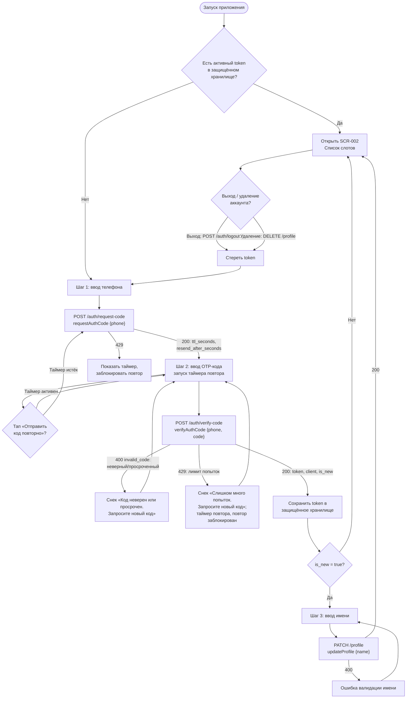

# OTP-авторизация и сессия

**ID:** LOGIC-001  
**Тип:** Логика  
**Домен:** 09. Логики  
**Приоритет:** Critical  
**Статус:** Черновик  
**Функциональные блоки:** FB-AUTH-001 (Вход по телефону), FB-AUTH-002 (Сессия и выход)

---

## История изменений

| Релиз | ТЗ | Описание изменений |
|-------|-----|-------------------|
| — | — | Первоначальная документация |

---

## Входные данные

| Название | Тип | Возможные значения | Описание |
|----------|-----|-------------------|----------|
| `token` | Защищённое хранилище | JWT-строка / отсутствует | Bearer-токен активной сессии. Если присутствует на старте — пользователь авторизован, SCR-001 пропускается. |
| `phone` | Состояние | E.164, `^\+[1-9]\d{1,14}$` | Введённый на шаге 1 номер телефона; хранится в состоянии флоу между шагами (не теряется при «Назад» и при ошибке кода). |
| `resend_after_seconds` | Состояние | integer (например, `60`) | Из ответа `requestAuthCode`/`verifyAuthCode`-флоу; задаёт обратный отсчёт таймера повторной отправки кода. |
| `ttl_seconds` | Состояние | integer (например, `300`) | Из ответа `requestAuthCode`; срок жизни OTP-кода. По истечении код считается невалидным (бэкенд вернёт 400). |
| `is_new` | Состояние | `true` / `false` | Из ответа `verifyAuthCode`. Управляет ветвлением: `true` → шаг 3 (ввод имени), `false` → сразу SCR-002. |

---

## Обзор

Логика описывает бесшовный вход в приложение «Волна» **по номеру телефона без пароля** через одноразовый код (OTP) и управление пользовательской сессией. Применяется на единой точке входа неавторизованного пользователя ([SCR-001](../SCR-001-registration.md)) и реализует трёхшаговый поток: ввод телефона → ввод кода из SMS → ввод имени (только для нового пользователя). После подтверждения кода выдаётся Bearer-токен сессии (JWT), который сохраняется в защищённом хранилище и обеспечивает автоматический вход при последующих запусках приложения.

Тот же механизм подтверждения по OTP переиспользуется при смене номера телефона в профиле ([SCR-007](../SCR-007-profile.md)); детализация смены телефона — в отдельном LOGIC/SCR-007, здесь фиксируется лишь общий механизм.

### User Story

> Как клиент SUP-клуба, я хочу входить в приложение по номеру телефона без пароля и оставаться авторизованным между запусками,
> чтобы быстро записаться на прогулку, не вспоминая учётные данные.

### Бизнес-ценность

- Минимальный порог входа (NFR-3): нет пароля, регистрация и вход — единый поток по уникальному номеру телефона.
- Сокращение пути к записи (NFR-2): сохранённая сессия пропускает экран входа и сразу открывает список слотов.
- Безопасность персональных данных: токен хранится в защищённом хранилище, инвалидируется при выходе и удалении аккаунта (NFR-11).

---

## Точки применения

| Экран/Компонент | Элемент/Триггер | Условие |
|-----------------|-----------------|---------|
| [SCR-001 Регистрация / Вход](../SCR-001-registration.md) | Кнопка «Получить код» (шаг 1) | Введён валидный телефон |
| [SCR-001 Регистрация / Вход](../SCR-001-registration.md) | Кнопка «Подтвердить» (шаг 2) | Введён код 4–6 цифр |
| [SCR-001 Регистрация / Вход](../SCR-001-registration.md) | Кнопка «Продолжить» (шаг 3) | `is_new = true` и введено имя |
| [SCR-001 Регистрация / Вход](../SCR-001-registration.md) | При запуске приложения | Проверка активной сессии (наличие `token`) |
| [SCR-007 Профиль](../SCR-007-profile.md) | Действие «Выйти» | Активная сессия |
| [SCR-007 Профиль](../SCR-007-profile.md) | Действие «Удалить аккаунт» | Активная сессия (после подтверждения, шторка SCR-007) |
| [SCR-007 Профиль](../SCR-007-profile.md) | Смена телефона (подтверждение OTP) | Общий механизм OTP; детализация — в LOGIC/SCR-007 |

---

## Флоу

---

## Описание логики

### Шаг 0: Проверка сессии при старте

При запуске приложение читает `token` из защищённого хранилища. Если токен присутствует — сессия считается активной, экран [SCR-001](../SCR-001-registration.md) **не показывается**, приложение открывается сразу на [SCR-002 Список слотов](../SCR-002-slot-list.md). Если токена нет — открывается шаг 1. Если любой авторизованный запрос вернёт `401` (токен невалиден/просрочен), токен стирается и пользователь возвращается на шаг 1.

### Шаг 1: Ввод телефона

Пользователь вводит номер телефона (числовая клавиатура, маска национального формата). Кнопка «Получить код» активна только при валидном по формату E.164 (`^\+[1-9]\d{1,14}$`) номере. **Формат телефона валидируется локально**: при невалидном вводе CTA остаётся disabled, запрос не уходит. По тапу — запрос `requestAuthCode`. Введённый `phone` сохраняется в состоянии флоу и используется на шаге 2. Из ответа берутся `ttl_seconds` и `resend_after_seconds`.

Поскольку формат проверяется на клиенте, сервер вернёт `400` на `requestAuthCode` **не из-за формата**, а по серверному правилу: номер в чёрном списке/заблокирован, служебный или иным образом недопустимый. Реакция UI — снек «Не удалось войти. Попробуйте ещё раз»; код не отправлен, переход на шаг 2 не выполняется, пользователь остаётся на шаге 1 и может исправить номер.

### Шаг 2: Ввод OTP-кода

Над полем — «Мы отправили код на `<номер>`». Поле кода — 4–6 цифр (`^\d{4,6}$`), числовая клавиатура, автофокус. Запускается таймер повторной отправки на `resend_after_seconds` секунд: ссылка «Отправить код повторно» неактивна и показывает обратный отсчёт; по истечении — активируется и при повторе вызывает `requestAuthCode` заново (таймер сбрасывается). Кнопка «Подтвердить» активна при полностью введённом коде; по тапу — запрос `verifyAuthCode` с `{phone, code}`. Кнопка «Назад» возвращает на шаг 1 без потери номера.

Отдельно обрабатываются три исхода проверки кода:

- **Просроченный код (истёк `ttl_seconds`).** По истечении срока жизни код невалиден — бэкенд вернёт `400` (`invalid_code`). Этот же ответ приходит при неверном коде; для пользователя они неотличимы, поэтому показывается единый снек «Код неверен или просрочен. Запросите новый код». Поле кода остаётся доступным, номер не теряется, повтор кода — по таймеру (или сразу, если отсчёт уже истёк).
- **Превышен лимит попыток ввода кода (429).** При слишком частых/многочисленных вызовах `verifyAuthCode` бэкенд вернёт `429`. Показывается снек «Слишком много попыток. Запросите новый код». Запускается (или перезапускается) обратный отсчёт `resend_after_seconds`; ссылка «Отправить код повторно» **заблокирована до конца отсчёта**, новый код можно запросить только по его истечении. Если `resend_after_seconds` отсутствует в ответе 429 — используется значение текущего активного таймера, при его отсутствии — дефолт `60` секунд.
- **Лимит запросов кода (429 на повторной отправке).** При `429` на `requestAuthCode` (тап «Отправить код повторно») новый код не отправляется: запускается новый обратный отсчёт `resend_after_seconds`, ссылка повтора блокируется до конца отсчёта; снек по каталогу не дублирует уже видимый на экране таймер.

### Шаг 3: Ввод имени (только для нового пользователя)

Выполняется **только при `is_new = true`** в ответе `verifyAuthCode`. Поле «Имя» (1–100 символов, автофокус). Кнопка «Продолжить» активна при заполненном/валидном имени; по тапу — запрос `updateProfile` с `{name}` (под уже сохранённым Bearer-токеном). По успеху — переход в [SCR-002](../SCR-002-slot-list.md). При `is_new = false` шаг полностью пропускается, переход в SCR-002 происходит сразу после шага 2.

### Шаг 4: Завершение сессии

«Выйти» ([SCR-007](../SCR-007-profile.md)) → `logout` (инвалидация токена на бэкенде) → стирание `token` из защищённого хранилища → возврат на шаг 1. «Удалить аккаунт» → `deleteAccount` (детализация в SCR-007) → также стирание `token` и возврат на шаг 1.

---

## API запросы

> Все эндпоинты — REST. Базовый URL — из конфигурации (prod `https://api.supclub.example/v1`).

### POST /auth/request-code

Источник: [../../api/auth/api.yaml](../../api/auth/api.yaml) → `requestAuthCode`

**Триггер:** Тап на кнопку «Получить код» (шаг 1); повтор — по истечении таймера на шаге 2.

**Headers:**

| Поле | Описание |
|------|----------|
| `Content-Type` | `application/json` |

> Авторизация не требуется (`security: []`).

**Параметры/Body:**

| Параметр | Тип | Описание | Значение/Источник |
|----------|-----|----------|-------------------|
| `phone` | string | Телефон в E.164, `^\+[1-9]\d{1,14}$` | Поле «Телефон», шаг 1 |

**Обработка ответа:**

| Результат | Действие |
|-----------|----------|
| Загрузка | CTA в состоянии Loading, повторные тапы заблокированы |
| Успех (200) | Сохранить `ttl_seconds`, `resend_after_seconds`; перейти на шаг 2, запустить таймер |
| Ошибка 400 | Формат уже проверен локально → 400 означает серверный отказ по номеру (чёрный список/заблокирован/служебный). Снек «Не удалось войти. Попробуйте ещё раз»; код не отправлен, остаёмся на шаге 1 |
| Ошибка 429 | Повтор — на шаге 2: запустить новый обратный отсчёт `resend_after_seconds`, заблокировать ссылку «Отправить код повторно» до его истечения; новый запрос не слать (см. «Обработка ошибок») |
| Ошибка 5xx | Снек «Произошла ошибка. Попробуйте позже» (00-foundations §6) |
| Ошибка сети | Снек «Не удалось загрузить. Проверьте соединение и попробуйте снова» (00-foundations §6) |

### POST /auth/verify-code

Источник: [../../api/auth/api.yaml](../../api/auth/api.yaml) → `verifyAuthCode`

**Триггер:** Тап на кнопку «Подтвердить» (шаг 2).

**Headers:**

| Поле | Описание |
|------|----------|
| `Content-Type` | `application/json` |

> Авторизация не требуется (`security: []`).

**Параметры/Body:**

| Параметр | Тип | Описание | Значение/Источник |
|----------|-----|----------|-------------------|
| `phone` | string | Телефон в E.164, `^\+[1-9]\d{1,14}$` | Состояние флоу (шаг 1) |
| `code` | string | OTP-код, `^\d{4,6}$` | Поле «Код из SMS», шаг 2 |

**Обработка ответа:**

| Результат | Действие |
|-----------|----------|
| Загрузка | CTA «Подтвердить» в Loading, поля заблокированы |
| Успех (200) | Сохранить `token` в защищённое хранилище; если `is_new = true` → шаг 3, иначе → SCR-002 |
| Ошибка 400 (`invalid_code`) | Код неверен **или просрочен** (`ttl_seconds` истёк) — для пользователя неотличимо. Снек «Код неверен или просрочен. Запросите новый код»; номер не теряется, можно ввести заново или запросить новый код по таймеру |
| Ошибка 429 (лимит попыток) | Снек «Слишком много попыток. Запросите новый код»; запустить/перезапустить обратный отсчёт `resend_after_seconds`, заблокировать «Отправить код повторно» до его истечения |
| Ошибка 5xx | Снек «Произошла ошибка. Попробуйте позже» |
| Ошибка сети | Снек «Не удалось загрузить. Проверьте соединение и попробуйте снова» |

**Структура ответа (200):** `{ token, client { id, phone, name, created_at }, is_new }`.

### PATCH /profile

Источник: [../../api/profile/api.yaml](../../api/profile/api.yaml) → `updateProfile`

**Триггер:** Тап на кнопку «Продолжить» (шаг 3, только при `is_new = true`).

**Headers:**

| Поле | Описание |
|------|----------|
| `Content-Type` | `application/json` |
| `Authorization` | `Bearer <token>` — токен, полученный на шаге 2 |

**Параметры/Body:**

| Параметр | Тип | Описание | Значение/Источник |
|----------|-----|----------|-------------------|
| `name` | string | Имя клиента, 1–100 символов | Поле «Имя», шаг 3 |

**Обработка ответа:**

| Результат | Действие |
|-----------|----------|
| Загрузка | CTA «Продолжить» в Loading |
| Успех (200) | Регистрация завершена; переход в SCR-002 |
| Ошибка 400 | Подсветка поля «Имя» + текст ошибки под полем («Проверьте имя — кажется, тут лишние символы») |
| Ошибка 401 | Стереть токен, вернуть на шаг 1 |
| Ошибка 5xx | Снек «Произошла ошибка. Попробуйте позже» |
| Ошибка сети | Снек «Не удалось загрузить. Проверьте соединение и попробуйте снова» |

### POST /auth/logout

Источник: [../../api/auth/api.yaml](../../api/auth/api.yaml) → `logout`

**Триггер:** Действие «Выйти» на [SCR-007](../SCR-007-profile.md).

**Headers:**

| Поле | Описание |
|------|----------|
| `Authorization` | `Bearer <token>` |

**Параметры/Body:** отсутствует.

**Обработка ответа:**

| Результат | Действие |
|-----------|----------|
| Успех (204) | Стереть `token` из защищённого хранилища; перейти на SCR-001 (шаг 1) |
| Ошибка 401 | Токен уже невалиден — также стереть `token` и перейти на SCR-001 |
| Ошибка 5xx / сеть | Снек по 00-foundations §6; локально токен стирается, пользователь выходит в SCR-001 |

---

## Локальное хранение

| Ключ | Тип хранения | Описание |
|------|--------------|----------|
| `token` | Защищённое хранилище (Keychain / Keystore) | Bearer JWT сессии. Записывается после `verifyAuthCode` (200). Подставляется в `Authorization: Bearer <token>` во все авторизованные запросы. Стирается при выходе, удалении аккаунта и при `401`. |

---

## Связанные требования

### Функциональные (REQ-FUNC-*)

| ID | Название | Приоритет |
|----|----------|-----------|
| FR-1 | Регистрация клиента (телефон + код + имя для нового) | Critical |
| FR-2 | Авторизация / вход по телефону с подтверждением кодом | Critical |

### Интеграции (REQ-INT-*)

| ID | Название | Приоритет |
|----|----------|-----------|
| REQ-INT-AUTH | Auth API: `requestAuthCode`, `verifyAuthCode`, `logout` ([../../api/auth/api.yaml](../../api/auth/api.yaml)) | Critical |
| REQ-INT-PROFILE | Profile API: `updateProfile` ([../../api/profile/api.yaml](../../api/profile/api.yaml)) | Critical |

### UI (REQ-UI-*)

| ID | Название | Приоритет |
|----|----------|-----------|
| US-1 | Быстрый вход без барьеров (минимум полей по шагам) | High |

### Данные (REQ-DATA-*)

| ID | Название | Приоритет |
|----|----------|-----------|
| NFR-3 | Вход без пароля, минимальный порог входа | Critical |
| NFR-11 | Защита персональных данных; токен в защищённом хранилище | Critical |

---

## Критерии приёмки

| ID | Критерий |
|----|----------|
| AC-001 | **Дано** пользователь не авторизован, токена в защищённом хранилище нет, **Когда** он открывает приложение, **Тогда** показывается SCR-001 шаг 1 (ввод телефона). |
| AC-002 | **Дано** в защищённом хранилище есть активный `token`, **Когда** пользователь запускает приложение, **Тогда** SCR-001 пропускается и сразу открывается SCR-002 «Список слотов». |
| AC-003 | **Дано** введён валидный телефон в E.164, **Когда** пользователь нажал «Получить код» и `requestAuthCode` вернул 200, **Тогда** открывается шаг 2 с полем кода и запускается таймер повтора на `resend_after_seconds`. |
| AC-004 | **Дано** телефон уже зарегистрирован (`is_new = false`), **Когда** `verifyAuthCode` вернул 200, **Тогда** `token` сохраняется в защищённое хранилище и сразу открывается SCR-002, шаг 3 пропускается. |
| AC-005 | **Дано** номер новый (`is_new = true`) и код подтверждён, **Когда** пользователь вводит имя (1–100 символов) и нажимает «Продолжить» (`updateProfile` 200), **Тогда** регистрация завершается и открывается SCR-002. |
| AC-006 | **Дано** пользователь ввёл неверный или просроченный код, **Когда** `verifyAuthCode` вернул 400 (`invalid_code`), **Тогда** показывается «Код неверен или просрочен. Запросите новый код», вход не выполняется, номер сохранён, поле кода доступно для повтора. |
| AC-007 | **Дано** на шаге 2 идёт обратный отсчёт `resend_after_seconds` (или получен 429 на запрос/проверку кода), **Когда** пользователь пытается отправить код повторно, **Тогда** повтор заблокирован до конца отсчёта, по истечении ссылка активируется. |
| AC-010 | **Дано** пользователь несколько раз подряд ввёл код и `verifyAuthCode` вернул 429 (лимит попыток), **Когда** приложение обрабатывает ответ, **Тогда** показывается «Слишком много попыток. Запросите новый код», запускается/перезапускается обратный отсчёт `resend_after_seconds`, а кнопка «Отправить код повторно» заблокирована до его истечения. |
| AC-011 | **Дано** срок жизни кода `ttl_seconds` истёк, **Когда** пользователь подтверждает просроченный код и `verifyAuthCode` вернул 400, **Тогда** показывается «Код неверен или просрочен. Запросите новый код», и пользователь может запросить новый код по таймеру (или сразу, если отсчёт уже завершён). |
| AC-008 | **Дано** пользователь авторизован и находится на SCR-007, **Когда** он нажимает «Выйти» (`logout`), **Тогда** `token` стирается из защищённого хранилища и открывается SCR-001 шаг 1. |
| AC-009 | **Дано** авторизованный запрос вернул 401 (токен невалиден/просрочен), **Когда** приложение получает ответ, **Тогда** `token` стирается и пользователь переводится на SCR-001 шаг 1. |

---

## Обработка ошибок

| Тип ошибки | Контекст | Действие |
|------------|----------|----------|
| 400 серверный отказ по номеру | `requestAuthCode` (шаг 1) | Формат проверяется локально (CTA disabled при невалидном), поэтому 400 = серверный отказ: номер в чёрном списке/заблокирован/служебный. Снек «Не удалось войти. Попробуйте ещё раз»; код не отправлен, остаёмся на шаге 1. |
| 400 `invalid_code` (неверный/просроченный код) | `verifyAuthCode` (шаг 2) | Снек «Код неверен или просрочен. Запросите новый код»; неверный и просроченный (истёк `ttl_seconds`) код неотличимы. Поле кода доступно для повтора, номер не теряется, новый код — по таймеру. |
| 400 невалидное имя | `updateProfile` (шаг 3) | Подсветка поля «Имя» + текст под полем «Проверьте имя — кажется, тут лишние символы». |
| 429 лимит попыток ввода кода | `verifyAuthCode` (шаг 2) | Снек «Слишком много попыток. Запросите новый код»; запустить/перезапустить обратный отсчёт `resend_after_seconds`, заблокировать «Отправить код повторно» до его истечения; новый запрос проверки не слать. |
| 429 лимит запросов кода | `requestAuthCode` (шаг 1 / повтор на шаге 2) | Запустить новый обратный отсчёт `resend_after_seconds`, заблокировать «Отправить код повторно» до его истечения; новый запрос не слать. |
| 401 Unauthorized | Любой авторизованный запрос (`updateProfile`, `logout`) | Стереть `token`, перевести на SCR-001 шаг 1. |
| 5xx / `InternalError` | Любой запрос | Снек «Произошла ошибка. Попробуйте позже» (00-foundations §6). |
| Ошибка сети | Любой запрос | Снек «Не удалось загрузить. Проверьте соединение и попробуйте снова» (00-foundations §6). |
| Двойная отправка | CTA любого шага | Повторные тапы во время Loading заблокированы (защита от дублей). |

---
