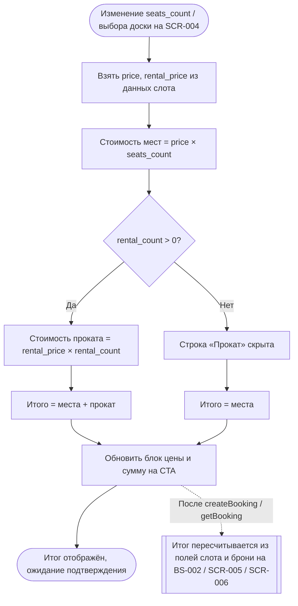

# Расчёт цены брони

**ID:** LOGIC-003  
**Тип:** Логика  
**Домен:** 09. Логики  
**Приоритет:** High  
**Статус:** Черновик  
**Функциональные блоки:** FB-BOOKING-001

---

## История изменений

| Релиз | ТЗ | Описание изменений |
|-------|-----|-------------------|
| — | — | Первоначальная документация |

---

## Входные данные

> Логика расчётная и работает на данных, уже полученных от API (слот / бронь). Собственного кэша, состояния или Remote Config не требует — ниже перечислены поля-источники.

| Название | Тип | Возможные значения | Описание |
|----------|-----|-------------------|----------|
| `price` | Данные слота (`getSlot` / `SlotSummary`) | целое ≥ 0, RUB | Цена за одно место. |
| `rental_price` | Данные слота (`getSlot` / `SlotSummary`) | целое ≥ 0, RUB | Тариф проката за **одну прокатную доску** (за доску, не за место). |
| `seats_count` | Состояние формы SCR-004 / поле брони | `1`–`3` | Число мест в брони. |
| `rental_count` | Состояние формы SCR-004 / поле брони | `0`–`3` (≤ `seats_count`) | Число прокатных досок. |

> **Об итоговой цене (`price_total`).** Итоговая цена брони — **производная**: отдельным полем **не хранится** и API её **не возвращает** (подтверждено в [data-model.md](../../4-design/data-model.md): «Итоговая цена брони — производная, отдельным полем не хранится»). Источник истины — **клиентский расчёт** `price × seats_count + rental_price × rental_count` из полей слота (`price`, `rental_price`) и параметров брони (`seats_count`, `rental_count`). Поэтому отдельной строки `price_total` среди входных данных нет — итог везде вычисляется из перечисленных выше полей.

---

## Обзор

Логика вычисляет итоговую стоимость брони SUP-прогулки и отвечает за её отображение во всех точках клиентского сценария. Итог — **производная величина**: отдельным полем не хранится и API его не возвращает. На этапе оформления (SCR-004) он считается **на клиенте в реальном времени** по формуле из полей слота; на экранах уже оформленных броней (BS-002 / SCR-005 / SCR-006) показывается **расчётно из тех же полей** (`price`, `rental_price`, `seats_count`, `rental_count`), а не из отдельного поля ответа.

**Формула:**

```
Итого = price × seats_count + rental_price × rental_count
```

- `price` — цена за одно место; `rental_price` — тариф за одну прокатную доску (тарифицируется отдельно, поэтому итог зависит и от числа прокатных мест). Оба значения берутся из данных слота.
- Прокат считается **за доску, а не за место**: на места со «своей» доской `rental_price` не начисляется.
- Валюта — RUB, значения целые.

Оплата — **офлайн** (наличные / перевод на карту); онлайн-оплаты в приложении нет. Цена и итог носят информационный характер и фиксируются вместе с записью.

### User Story

> Как Клиент, я хочу заранее видеть итоговую цену брони с разбивкой по местам и прокату,
> чтобы понимать, сколько подготовить к оплате на месте, и подтверждать запись без сюрпризов.

### Бизнес-ценность

- Прозрачность стоимости до подтверждения — клиент видит итог и его состав в момент выбора.
- Корректность расчёта: единая формула на всех экранах (итог всегда вычисляется из одних и тех же полей слота и брони) исключает расхождения.
- Снижение барьера к записи — понятная цена и явное правило офлайн-оплаты вместо WhatsApp/тетради.

---

## Точки применения

| Экран/Компонент | Элемент/Триггер | Условие |
|-----------------|-----------------|---------|
| [SCR-003 Карточка слота](../SCR-003-slot-card.md) | При открытии — цена за место (`price`) | Всегда |
| [SCR-004 Оформление записи](../SCR-004-booking.md) | Блок цены (разбивка + итог) и сумма на кнопке «Записаться»; пересчёт при изменении мест / выбора доски | Всегда (на экране оформления) |
| [BS-002 Подтверждение записи](../BS-002-booking-success.md) | Итог в сводке оформленной брони (расчётно из полей слота и брони) | Всегда |
| [SCR-005 Мои брони](../SCR-005-my-bookings.md) | Итог брони в карточке списка (расчётно из полей слота и брони) | Всегда |
| [SCR-006 Детали брони](../SCR-006-booking-details.md) | Итог брони (расчётно из полей слота и брони) | Всегда |

---

## Флоу



---

## Описание логики

### Шаг 1: Получение исходных данных

`price` и `rental_price` берутся из данных слота (`getSlot` — поля `Slot.price` / `Slot.rental_price`; в списках — `SlotSummary`). Значения не зашиваются в макет, приходят из API. `seats_count` и `rental_count` — из состояния формы SCR-004 (степпер числа мест и переключатели «Своя / Прокатная»; `rental_count` = число мест с выбором «Прокатная»).

### Шаг 2: Расчёт составляющих

- Стоимость мест = `price × seats_count`.
- Стоимость проката = `rental_price × rental_count` (начисляется только за прокатные доски; «своя» доска не тарифицируется).

### Шаг 3: Итог и разбивка в UI

Итог = сумма составляющих. В блоке цены (SCR-004 §6.3) выводятся:
- строка **«Места: `price` × `seats_count`»** с суммой по местам;
- строка **«Прокат: `rental_price` × `rental_count`»** — **скрыта, если `rental_count = 0`**;
- строка **«Итого»** — крупно и контрастно (важное число, foundations §3.2); итог дублируется суммой на кнопке «Записаться».

Под ценой — текст об офлайн-оплате (Шаг 5).

### Шаг 4: Пересчёт в реальном времени

При любом изменении числа мест (`seats_count`) или варианта доски на любом месте (что меняет `rental_count`) итог и все строки разбивки пересчитываются немедленно, без отдельного действия пользователя. Сумма на CTA обновляется синхронно.

### Шаг 4а: Граничные значения цены

- **Цена 0 (бесплатно).** Если `price = 0` (и/или `rental_price = 0`) — это **валидный** случай: соответствующая составляющая = 0, итог выводится как **«0 ₽»**, строки разбивки показываются обычным образом, CTA «Записаться» остаётся **доступным**. Ноль трактуется как «бесплатно», а не как «нет цены».
- **Невозможно рассчитать цену.** Если `price` (или при `rental_count > 0` — `rental_price`) приходит как `null`, отрицательное значение или без валюты — рассчитать итог нельзя. В этом случае **цена не показывается** (вместо суммы — «—»), строка «Итого» и сумма на CTA не выводятся, а **CTA «Записаться» блокируется** — чтобы нельзя было оформить бронь без корректной цены. Обратная связь — по паттерну состояний [LOGIC-008](LOGIC-008_Паттерн-состояний-экрана.md): Error-заглушка при первичной загрузке или ненавязчивый снек из каталога снеков ([LOGIC-008 §«Шаг 6: Каталог снеков»](LOGIC-008_Паттерн-состояний-экрана.md), [00-foundations §6](../../3-design-brief/00-foundations.md)).

### Шаг 5: Текст об оплате (офлайн)

Под блоком цены показывается стандартная формулировка из foundations §6: **«Оплата на месте: наличные или перевод на карту.»** Онлайн-оплаты нет.

### Шаг 6: Итог уже оформленной брони

Итог не хранится отдельным полем и API его не возвращает. На BS-002, SCR-005 и SCR-006 он **вычисляется по той же формуле** из полей зафиксированной брони и её слота (`price`, `rental_price`, `seats_count`, `rental_count`). Поскольку формула и поля-источники одни и те же, итог на этих экранах совпадает с суммой, показанной при оформлении на SCR-004.

---

## API запросы

> Секция справочная: собственных запросов логика не инициирует. Данные приходят из запросов соответствующих экранов.

### Источники данных

| Источник | Поля | Где используется |
|----------|------|------------------|
| `getSlot` (SCR-003/SCR-004) / список слотов | `price`, `rental_price` | Расчёт итога на клиенте (Шаги 1–4) |
| `getBooking` / список броней (вместе с данными слота брони) | `seats_count`, `rental_count`, `price`, `rental_price` | Расчёт итога оформленной брони на BS-002 / SCR-005 / SCR-006 (Шаг 6); отдельного поля `price_total` API не возвращает |

---

## Связанные требования

### Функциональные (REQ-FUNC-*)

| ID | Название | Приоритет |
|----|----------|-----------|
| FR-30 | Отображение цены брони и офлайн-оплата | High |

### UI (REQ-UI-*)

| ID | Название | Приоритет |
|----|----------|-----------|
| US-11 | Клиент видит итоговую цену брони с разбивкой | High |

### Данные (REQ-DATA-*)

| ID | Название | Приоритет |
|----|----------|-----------|
| NFR-2 | ≤ 3 экранов до подтверждения — цена видна без лишних шагов | High |

---

## Критерии приёмки

| ID | Критерий |
|----|----------|
| AC-001 | **Дано** слот с `price` и выбрано `seats_count` мест без проката, **Когда** клиент на SCR-004, **Тогда** итог = `price × seats_count`, строка «Прокат» скрыта, та же сумма показана на кнопке «Записаться». |
| AC-002 | **Дано** в брони `rental_count = 0`, **Когда** отображается блок цены, **Тогда** строка «Прокат» **не показывается**, выводятся только «Места» и «Итого». |
| AC-003 | **Дано** часть мест с прокатной доской (`rental_count > 0`), **Когда** клиент выбрал доски, **Тогда** итог = `price × seats_count + rental_price × rental_count`, появляется строка «Прокат: `rental_price` × `rental_count`», и прокат начисляется за доски, а не за все места. |
| AC-004 | **Дано** клиент меняет число мест или переключает «Своя / Прокатная», **Когда** значение изменилось, **Тогда** строки разбивки, «Итого» и сумма на CTA пересчитываются в реальном времени без дополнительного действия. |
| AC-005 | **Дано** бронь оформлена, **Когда** клиент открывает BS-002, SCR-005 или SCR-006, **Тогда** итог вычисляется по формуле из полей брони и её слота (`price × seats_count + rental_price × rental_count`), отдельного поля `price_total` API не возвращает, и итог совпадает с суммой, показанной при оформлении. |
| AC-006 | **Дано** любой экран с ценой, **Когда** показывается стоимость, **Тогда** под итогом присутствует текст «Оплата на месте: наличные или перевод на карту.» и отсутствуют элементы онлайн-оплаты. |
| AC-007 | **Дано** значения `price` / `rental_price` приходят из данных слота, **Когда** рендерится цена, **Тогда** числа не зашиты в макет и валюта — RUB (целые значения). |
| AC-008 | **Дано** `price` = `0` (и/или `rental_price` = `0` при наличии проката), **Когда** считается итог, **Тогда** это валидный случай: итог показывается как «0 ₽», строки разбивки выводятся обычным образом, CTA «Записаться» **доступен**. |
| AC-009 | **Дано** `price` или (при `rental_count > 0`) `rental_price` равны `null` / отрицательны / без валюты, **Когда** рассчитать итог невозможно, **Тогда** цена не показывается (вместо суммы — «—»), CTA «Записаться» **заблокирован**, и состояние сообщается по паттерну из [LOGIC-008](LOGIC-008_Паттерн-состояний-экрана.md) (Error-состояние / снек). |

---

## Обработка ошибок

| Тип ошибки | Контекст | Действие |
|------------|----------|----------|
| Нет данных слота (`price` / `rental_price` отсутствуют — поле не пришло) | SCR-004 не получил актуальный слот | Блок цены и CTA не активны; экран следует паттерну Loading/Error (foundations §5, [LOGIC-008](LOGIC-008_Паттерн-состояний-экрана.md)), расчёт не выполняется до получения данных. |
| Некорректная цена: `price` (или при `rental_count > 0` — `rental_price`) = `null`, отрицательная или без валюты | SCR-004 / любой экран с ценой | Рассчитать итог невозможно → **цену не показываем** (вместо суммы — «—»), строка «Итого» и сумма на CTA не выводятся; **CTA «Записаться» блокируется** — нельзя оформить бронь без корректной цены. Обратная связь — по паттерну из [LOGIC-008](LOGIC-008_Паттерн-состояний-экрана.md) (см. ниже «Цена не рассчиталась»). |
| Цена = `0` (бесплатно) | `price` = `0` (и/или `rental_price` = `0`) | **Валидный случай, не ошибка**: итог выводится как «0 ₽», разбивка показывается обычным образом, CTA «Записаться» **доступен**. |
| Цена не рассчиталась (нет данных / некорректная цена) | Обратная связь пользователю | Первичная загрузка без данных → Error-заглушка по паттерну [LOGIC-008 §«Шаг 4: Error»](LOGIC-008_Паттерн-состояний-экрана.md) (нейтральный текст + «Обновить»). Сбой при обновлении (PTR) → контент сохраняется, ненавязчивый снек из каталога [LOGIC-008 §«Шаг 6: Каталог снеков»](LOGIC-008_Паттерн-состояний-экрана.md) / [00-foundations §6](../../3-design-brief/00-foundations.md). Тексты — из общего каталога, своих строк ошибки логика не вводит. |
| `rental_count > seats_count` (некорректный ввод) | Формирование брони на SCR-004 | Состояние блокируется правилами лимитов SCR-004 §6.5 (прокат ≤ число мест); расчёт ведётся только по валидной комбинации. |

---
