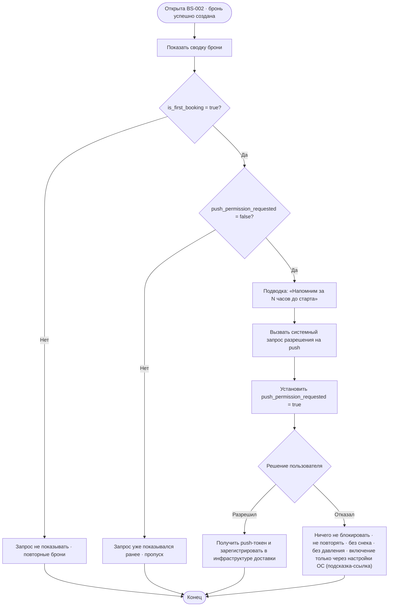

# Запрос разрешения на push-уведомления

**ID:** LOGIC-007  
**Тип:** Логика  
**Домен:** 09. Логики  
**Приоритет:** Medium  
**Статус:** Черновик  
**Функциональные блоки:** FB-NOTIFY-001 (Напоминания о записи), FB-BOOKING-003 (Завершение записи)

---

## История изменений

| Релиз | ТЗ | Описание изменений |
|-------|-----|-------------------|
| — | — | Первоначальная документация |

---

## Входные данные

> Логика опирается на признак «первая бронь» (из данных созданной брони/профиля) и на
> локальный флаг «запрос разрешения уже показывался». Текст подводки зависит от значения `N`
> (за сколько часов напоминать) из конфигурации. Канал доставки (push/SMS) уточняется отдельно
> и обеспечивается существующей инфраструктурой — приложение лишь регистрирует push-токен.

| Название | Тип | Возможные значения | Описание |
|----------|-----|-------------------|----------|
| `is_first_booking` | Состояние (поле брони/клиента) | `true` / `false` | Признак того, что только что созданная бронь — **первая успешная запись** клиента. Источник — данные созданной брони / профиля (например, число прошлых броней = 0). |
| `push_permission_requested` | Локальный кэш | `true` / `false` (по умолчанию `false`) | Локальный флаг «системный запрос разрешения на push уже показывался на этом устройстве». Не сбрасывается между сессиями. |
| `system_push_status` | Состояние ОС | `not_determined` / `authorized` / `denied` | Текущий статус разрешения на push по данным системного API уведомлений. Управляется ОС, читается приложением. |
| `reminder_hours` (`N`) | Remote Config | целое, напр. `3` | За сколько часов до старта приходит напоминание. Подставляется в текст подводки («Напомним за N часов до старта»). **Не хардкодится.** |

---

## Обзор

Логика определяет **единственный момент** в продукте, когда у клиента запрашивается системное
разрешение на push-уведомления, и выполняет регистрацию push-токена при согласии. Запрос
показывается **только после первой успешной записи** — на шторке подтверждения
[BS-002](../BS-002-booking-success.md), когда ценность напоминаний очевидна
(«напомним за N часов до старта»), а не на старте приложения и не в профиле.

Принцип запроса: показать **один раз**, по факту первой брони, спокойно и без давления (P6).
При повторных бронях запрос **не повторяется**. Отказ клиента ничего не блокирует, не
сопровождается повторами и навязыванием. При согласии приложение регистрирует push-токен в
существующей инфраструктуре доставки; саму доставку напоминаний/уведомлений об отмене
обеспечивает инфраструктура (канал push/SMS уточняется отдельно — FR-33, NFR-13).

В MVP **нет отдельного UI управления уведомлениями** (ни в профиле [SCR-007], ни иного экрана):
это **осознанное ограничение MVP** (foundations §8.1 — отдельного экрана/раздела управления
уведомлениями в MVP нет). Приложение запрашивает разрешение **один раз** (на BS-002 после первой
записи); внутриприложенного тоггла/экрана управления уведомлениями нет. Если разрешение
отклонено, повторное включение возможно **только через системные настройки ОС** — приложение
**не вводит** отдельного раздела управления, но **может показать подсказку-ссылку «Включить в
настройках телефона»** (deep link в системные настройки приложения). Это закрывает тупик: клиент
не блокируется навсегда, а получает понятный путь включения через ОС.

### User Story

> Как клиент, я хочу после первой записи разрешить напоминания о прогулке,
> чтобы не забыть и не пропустить старт, — но без навязчивых запросов, если я отказался.

### Бизнес-ценность

- Снижение неявок: заблаговременное напоминание о предстоящей прогулке (US-12, NFR-13).
- Высокая конверсия согласия: запрос показывается в момент очевидной ценности (после первой
  брони), а не «вхолодную» на старте.
- Уважение к пользователю и принцип спокойствия (P6): один запрос, без давления, отказ ничего
  не ломает.

---

## Точки применения

| Экран/Компонент | Элемент/Триггер | Условие |
|-----------------|-----------------|---------|
| [BS-002 Подтверждение записи](../BS-002-booking-success.md) | После показа сводки брони (§6.4) — подводка «включить напоминания» → системный запрос разрешения | Только если `is_first_booking = true` **и** `push_permission_requested = false` |

> Запрос **не** инициируется на [SCR-001 Регистрация/Вход](../SCR-001-registration.md)
> и **не** в [SCR-007 Профиль](../SCR-007-profile.md) — см.
> [foundations §8.1](../../3-design-brief/00-foundations.md#81-напоминания-и-уведомления-fr-33-nfr-13).

---

## Флоу

---

## Описание логики

### Шаг 1: Проверка условий показа

После отрисовки сводки на BS-002 логика проверяет два условия:
`is_first_booking = true` **и** `push_permission_requested = false`. Если хотя бы одно не
выполнено (повторная бронь либо запрос уже показывался на устройстве) — запрос **не
показывается**, флоу завершается. Это гарантирует ровно один показ за всё время использования.

### Шаг 2: Подводка к ценности

Перед системным диалогом показывается спокойная подводка о ценности напоминаний —
**«Напомним за N часов до старта»**, где `N` берётся из конфигурации (`reminder_hours`), не
хардкодится. Тон — без давления и восклицаний (P6, foundations §6). Точная формулировка — за
копирайтером.

### Шаг 3: Системный запрос разрешения

Вызывается **системный API уведомлений** ОС (request authorization). Сразу после инициирования
запроса логика выставляет локальный флаг `push_permission_requested = true` — независимо от
последующего решения пользователя, чтобы запрос больше не повторялся.

### Шаг 4: Обработка согласия

При согласии (`system_push_status = authorized`) приложение получает push-токен от ОС/сервиса
доставки и **регистрирует его** в существующей инфраструктуре уведомлений (см. раздел
«API запросы / интеграция»). Дальнейшую доставку напоминаний и уведомлений об отмене
обеспечивает инфраструктура; канал (push/SMS) уточняется отдельно.

### Шаг 5: Обработка отказа

При отказе (`system_push_status = denied`) запись не блокируется, шторка работает штатно,
переходы «Мои бронирования»/«Готово» доступны. Запрос **не повторяется** ни в этой, ни в
последующих сессиях/бронях; навязывания и повторных диалогов нет (P6). Отдельным снеком/тостом
отказ **не сопровождается** — чтобы не давить на клиента (P6); ценность уже была озвучена в
подводке (Шаг 2), а отказ — это нормальный сценарий.

Повторное включение push в MVP из приложения недоступно (отдельного раздела управления нет).
Допустимо показать **подсказку-ссылку «Включить в настройках телефона»** (deep link в системные
настройки приложения как осознанный выход из тупика, не отдельный раздел управления).

**Разграничение «отказано один раз» vs «отказано навсегда» (платформенные различия).** Один и
тот же `system_push_status = denied` означает разное на разных платформах, и это влияет на
возможность повторного **системного** запроса:

- **iOS:** после первого отказа повторный системный диалог разрешения **невозможен** — ОС
  больше не покажет нативный запрос. Единственный путь включения — системные настройки ОС
  (через подсказку-ссылку выше). Фактически любой отказ на iOS = «отказано навсегда».
- **Android:** поведение **зависит от версии ОС**. На части версий повторный системный запрос
  возможен (до явного «больше не спрашивать»/нескольких отказов), после чего ОС перестаёт
  показывать диалог — состояние эквивалентно «отказано навсегда», и дальше только настройки ОС.

Важно: эта логика всё равно показывает системный запрос **строго один раз** (флаг
`push_permission_requested`, Шаг 3), независимо от платформенных нюансов повторного показа. То
есть приложение **не** пользуется возможностью повторного системного запроса на Android — единый
для платформ контракт «один запрос за всё время», а дальнейшее включение после отказа — только
через системные настройки ОС.

---

## API запросы

> **Вызовов нашего REST API эта логика не делает.** Запрос разрешения — обращение к
> **системному API уведомлений** ОС; доставка напоминаний/уведомлений об отмене —
> **внешняя существующая инфраструктура** (FR-33, NFR-13). Роль приложения — при согласии
> **зарегистрировать push-токен** в этой инфраструктуре.

### Интеграция: системный API уведомлений (ОС)

**Триггер:** показ BS-002 при первой брони (Шаг 3).

| Операция | Описание | Результат |
|----------|----------|-----------|
| Request authorization | Системный диалог запроса разрешения на push | `authorized` → Шаг 4; `denied` → Шаг 5 |
| Get device push token | Получение push-токена устройства (при `authorized`) | Токен для регистрации в инфраструктуре |

### Интеграция: регистрация push-токена в инфраструктуре доставки

**Триггер:** получение токена после согласия (Шаг 4).

| Параметр | Тип | Описание | Значение/Источник |
|----------|-----|----------|-------------------|
| `push_token` | string | Токен устройства для адресной доставки | Системный API уведомлений (ОС/сервис доставки) |
| `client_id` / привязка | — | Привязка токена к текущему клиенту | Текущая сессия клиента |

**Обработка ответа (регистрация токена):**

| Результат | Действие |
|-----------|----------|
| Успех | Токен зарегистрирован; напоминания будет доставлять инфраструктура. UI BS-002 не меняется. |
| Ошибка регистрации | Тихо игнорировать в UI (не показывать ошибку клиенту); допускается отложенная повторная регистрация при следующем запуске. Запись/шторка не страдают. |
| Ошибка сети | Не блокировать BS-002; повторить регистрацию токена позже (например, при следующем запуске с `authorized`). |

> Конкретный контракт регистрации токена (endpoint/протокол) определяется существующей
> инфраструктурой доставки и уточняется отдельно; в скоуп клиентского REST API «Волны» он не
> входит.

---

## Локальное хранение

| Ключ | Тип хранения | Описание |
|------|--------------|----------|
| `push_permission_requested` | Локальный кэш | Флаг «системный запрос разрешения на push уже показывался на этом устройстве». Выставляется в `true` при инициировании системного диалога (Шаг 3). Используется, чтобы запрос **не повторялся** при повторных бронях. По умолчанию `false`. |

---

## Связанные требования

### Функциональные (REQ-FUNC-*)

| ID | Название | Приоритет |
|----|----------|-----------|
| FR-33 | Напоминание о предстоящей записи; доставку push/SMS обеспечивает существующая инфраструктура (приложение регистрирует push-токен и/или отображает напоминание) | Should |

### Интеграции (REQ-INT-*)

| ID | Название | Приоритет |
|----|----------|-----------|
| — | Системный API уведомлений ОС (запрос разрешения, получение токена) | Medium |
| — | Регистрация push-токена в существующей инфраструктуре доставки (канал push/SMS уточняется) | Medium |

### UI (REQ-UI-*)

| ID | Название | Приоритет |
|----|----------|-----------|
| US-12 | Получать напоминание о предстоящей записи, чтобы не забыть и не пропустить прогулку | Medium (Should) |

### Данные (REQ-DATA-*)

| ID | Название | Приоритет |
|----|----------|-----------|
| NFR-13 | Своевременная доставка напоминаний (заблаговременно до старта); доставку обеспечивает существующая инфраструктура | Средний |

> Связанные источники: [foundations §8.1](../../3-design-brief/00-foundations.md#81-напоминания-и-уведомления-fr-33-nfr-13)
> (момент и единственность запроса, P6), [BS-002 §6.4 и Решение №3](../BS-002-booking-success.md#64-запрос-разрешения-на-push-после-первой-записи).

---

## Критерии приёмки

> Формат: **Дано** {контекст}, **Когда** {действие}, **Тогда** {результат}

| ID | Критерий |
|----|----------|
| AC-001 | **Дано** это первая успешная запись клиента (`is_first_booking = true`, `push_permission_requested = false`), **Когда** открыта шторка BS-002 и показана сводка, **Тогда** после сводки показывается подводка «Напомним за N часов до старта» и вызывается системный запрос разрешения на push. |
| AC-002 | **Дано** запрос разрешения уже показывался ранее (`push_permission_requested = true`) или это **не** первая бронь (`is_first_booking = false`), **Когда** открыта BS-002, **Тогда** системный запрос разрешения **не показывается**. |
| AC-003 | **Дано** клиент совершает вторую и последующие записи, **Когда** открывается BS-002, **Тогда** запрос разрешения на push **не повторяется** ни при каких условиях. |
| AC-004 | **Дано** показан системный запрос, **Когда** клиент **отказывает** в разрешении, **Тогда** запись и шторка работают штатно, переходы доступны, запрос больше **не повторяется** и нет повторных диалогов/давления (P6). |
| AC-005 | **Дано** показан системный запрос, **Когда** клиент **разрешает** push, **Тогда** приложение получает push-токен и регистрирует его в инфраструктуре доставки; UI BS-002 при этом не меняется. |
| AC-006 | **Дано** клиент проходит регистрацию/вход (SCR-001) или открывает профиль (SCR-007), **Когда** он на этих экранах, **Тогда** системный запрос разрешения на push **не инициируется** (единственная точка — BS-002 при первой брони). |
| AC-007 | **Дано** значение `reminder_hours = N` задано в конфигурации, **Когда** показывается подводка к запросу, **Тогда** в тексте подставляется именно это `N` («за N часов до старта») без хардкода. |
| AC-008 | **Дано** в MVP нет отдельного UI управления уведомлениями, **Когда** клиент хочет изменить решение, **Тогда** в приложении нет элементов включения/выключения push (изменение — только через системные настройки ОС). |
| AC-009 | **Дано** клиент **отказал** в разрешении, **Когда** обрабатывается отказ, **Тогда** отдельный снек/тост об отказе **не показывается** (без давления, P6); допускается ненавязчивая подсказка-ссылка «Включить в настройках телефона» (deep link в системные настройки), но отдельный раздел управления не появляется. |
| AC-010 | **Дано** клиент на iOS **один раз отказал** в разрешении, **Когда** он совершает следующие брони, **Тогда** нативный системный диалог разрешения **повторно не вызывается** (ОС не покажет его после отказа) — единственный путь включения остаётся через системные настройки ОС. |
| AC-011 | **Дано** запрос уже показывался (`push_permission_requested = true`) и приложение перезапущено / сессия завершена, **Когда** клиент создаёт новую бронь и открывается BS-002, **Тогда** флаг сохраняется между сессиями и системный запрос **повторно не вызывается**. |
| AC-012 | **Дано** локальное хранилище флага `push_permission_requested` сбоит (значение не прочитано/не сохранено), **Когда** проверяются условия показа, **Тогда** логика трактует флаг как `false` по умолчанию и **не падает**; при невозможности сохранить флаг после показа запрос в крайнем случае может быть показан повторно при следующей возможности, но без давления и без зацикливания (P6). |

---

## Обработка ошибок

| Тип ошибки | Контекст | Действие |
|------------|----------|----------|
| Отказ в разрешении (`denied`) | Клиент отклонил системный диалог | Не блокировать запись/шторку; не повторять запрос; без снека/тоста и без давления (P6). Флаг `push_permission_requested = true` уже выставлен. Включение в дальнейшем — только через системные настройки ОС (допустима подсказка-ссылка). |
| Отказ как «отказано навсегда» (платформенно) | iOS: после первого отказа повторный системный диалог невозможен. Android: зависит от версии ОС | Логика в любом случае не инициирует повторный системный запрос (один показ по флагу). Дальнейшее включение — только через системные настройки ОС. |
| Сбой локального хранилища флага | `push_permission_requested` не прочитан/не сохранён | Не падать; трактовать как `false` по умолчанию. Если флаг не удалось сохранить после показа — допустим повторный показ при следующей возможности, но без зацикливания и давления (P6). |
| Ошибка получения токена | Согласие получено, но токен от ОС/сервиса не пришёл | Тихо игнорировать в UI; повторить попытку регистрации при следующем запуске (если статус `authorized`). |
| Ошибка регистрации токена в инфраструктуре | Сбой/таймаут при отправке токена | Не показывать ошибку клиенту (на BS-002 нет error-состояния, см. BS-002 §7); отложить повторную регистрацию. Запись не страдает. |
| Ошибка сети | Нет соединения при регистрации токена | Не блокировать BS-002 и переходы; повторить регистрацию токена позже. |
| Системные push отключены глобально в ОС | ОС возвращает `denied`/недоступность канала | Трактовать как отказ: ничего не блокировать, запрос не повторять. |

---
