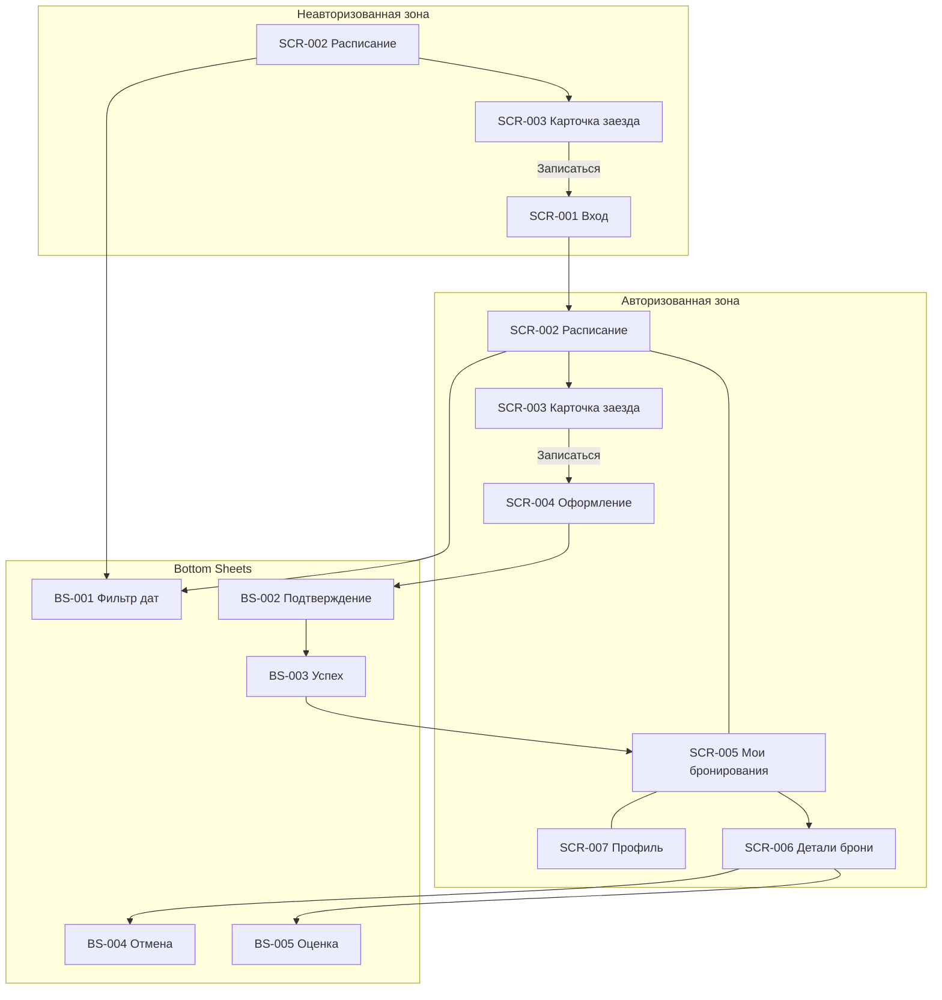

# Реестр экранов приложения «Апекс»

> Сформирован на основе [функциональных требований](../2-requirements/functional-requirements.md), [user stories](../2-requirements/user-stories.md) и [use cases](../2-requirements/use-cases.md).
> Постановки на дизайн — в отдельных файлах по [шаблону](00-design-brief-template.md).

**Обозначения типов:** **SCR** — экран; **BS** — bottom sheet / шторка.

---

## Сводная таблица

| ID | Название | Тип | Зона | Приоритет | Use Case | Постановка |
| :-- | :-- | :-- | :-- | :-- | :-- | :-- |
| — | Foundations (сквозные правила) | — | — | — | — | [00-foundations.md](00-foundations.md) |
| **SCR-001** | Вход / регистрация | Экран | НЗ → АЗ | P2 | UC-003 | [SCR-001-auth.md](SCR-001-auth.md) |
| **SCR-002** | Расписание заездов | Экран | НЗ + АЗ | P1 | UC-001 | [SCR-002-schedule.md](SCR-002-schedule.md) |
| **BS-001** | Фильтр по датам | Bottom Sheet | НЗ + АЗ | P2 | UC-001 | [BS-001-date-filter.md](BS-001-date-filter.md) |
| **SCR-003** | Карточка заезда | Экран | НЗ + АЗ | P1 | UC-002 | [SCR-003-ride-details.md](SCR-003-ride-details.md) |
| **SCR-004** | Оформление бронирования | Экран | АЗ | P1 | UC-004 | [SCR-004-booking.md](SCR-004-booking.md) |
| **BS-002** | Подтверждение бронирования | Bottom Sheet | АЗ | P1 | UC-004 | [BS-002-booking-confirm.md](BS-002-booking-confirm.md) |
| **BS-003** | Бронирование оформлено | Bottom Sheet | АЗ | P1 | UC-004 | [BS-003-booking-success.md](BS-003-booking-success.md) |
| **SCR-005** | Мои бронирования | Экран | АЗ | P1 | UC-006 | [SCR-005-my-bookings.md](SCR-005-my-bookings.md) |
| **SCR-006** | Детали бронирования | Экран | АЗ | P1 | UC-005, UC-008 | [SCR-006-booking-details.md](SCR-006-booking-details.md) |
| **BS-004** | Подтверждение отмены | Bottom Sheet | АЗ | P1 | UC-005 | [BS-004-cancel-confirm.md](BS-004-cancel-confirm.md) |
| **SCR-007** | Профиль | Экран | АЗ | P2 | UC-003 | [SCR-007-profile.md](SCR-007-profile.md) |
| **BS-005** | Оценка маршала | Bottom Sheet | АЗ | P3 | UC-007 | [BS-005-marshal-rating.md](BS-005-marshal-rating.md) |

---

## Карта навигации

---

## Покрытие требований

| Группа ФТ | Экраны |
| :-- | :-- |
| FT-001–005 (расписание) | SCR-002, BS-001, SCR-003 |
| FT-006–008 (авторизация) | SCR-001, SCR-007 |
| FT-009–016 (бронирование) | SCR-003, SCR-004, BS-002, BS-003 |
| FT-017–022 (отмена, статусы) | SCR-005, SCR-006, BS-004 |
| FT-023–024 (оплата) | SCR-004, BS-002, SCR-006 |
| FT-026–028 (оценка) | BS-005, SCR-006 |
| FT-029–030 (push) | Foundations §8; deep link → SCR-006 |

---

## Экраны, сознательно не включённые

| Что | Почему |
| :-- | :-- |
| Онлайн-оплата | FT-025, вне MVP |
| Лояльность | FT-031, вне MVP |
| Админка / маршал | NFR-002, другая система |
| Отдельный экран push-настроек | Достаточно системного диалога + foundations |

---

## Пользовательские потоки (MVP)

### Поток 1 · Запись на заезд
SCR-002 → SCR-003 → SCR-004 → BS-002 → BS-003 → SCR-005

### Поток 2 · Отмена записи
SCR-005 → SCR-006 → BS-004 → SCR-005

### Поток 3 · Оценка маршала (P3)
SCR-005 → SCR-006 → BS-005

### Поток 4 · Первый вход
SCR-002 → SCR-003 → SCR-001 → SCR-004 → BS-002 → BS-003 → SCR-005
