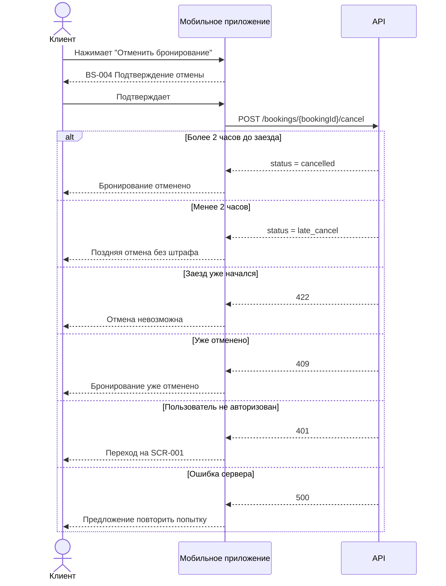

# Sequence-диаграмма API-взаимодействия

> Этап 3. Проектирование. Как клиентское мобильное приложение взаимодействует с сервером в основных сценариях бронирования и отмены записи на заезды картинг-центра «Апекс».

> **Сквозные правила взаимодействия**
>
> - Все запросы выполняются с `Authorization: Bearer <token>`.
> - При недействительном или просроченном токене сервер возвращает `401 Unauthorized`, после чего приложение переводит пользователя на экран авторизации (SCR-001).
> - Сервер является единственным источником информации о расписании, свободных местах и доступности экипировки.
> - Проверка свободных мест выполняется только сервером.
> - Создание и отмена бронирования выполняются атомарно, что исключает двойное бронирование.
> - При отсутствии сети пользователь получает сообщение об ошибке и возможность повторить запрос.

---

# Сценарий 1. Создание бронирования

Поток:

SCR-003 «Карточка заезда»
→ SCR-004 «Оформление бронирования»
→ POST /bookings
→ BS-002 «Подтверждение бронирования»

Во время оформления пользователь выбирает:

- количество участников;
- аренду экипировки (при необходимости).

После подтверждения приложение отправляет запрос на сервер.

```mermaid
sequenceDiagram
    actor User as Клиент
    participant App as Мобильное приложение
    participant API as API

    User->>App: Нажимает «Записаться»

    App->>API: POST /bookings

    Note over API:
    Проверка:
    • свободных мест
    • доступности экипировки
    • отсутствия дублей

    alt Бронирование успешно
        API-->>App: 201 Created
        App-->>User: BS-002 "Бронирование подтверждено"

    else Нет свободных мест
        API-->>App: 409 Conflict
        App-->>User: Сообщение "Свободных мест нет"

    else Недостаточно экипировки
        API-->>App: 409 Conflict
        App-->>User: Предложение выбрать собственную экипировку

    else Неверные данные
        API-->>App: 400 Bad Request
        App-->>User: Сообщение об ошибке

    else Пользователь не авторизован
        API-->>App: 401 Unauthorized
        App-->>User: Переход на SCR-001

    else Ошибка сервера
        API-->>App: 500
        App-->>User: Предложение повторить попытку

    end
```

### Последовательность

| Шаг | Что происходит |
|------|----------------|
| 1 | Пользователь подтверждает бронирование |
| 2 | Приложение отправляет POST /bookings |
| 3 | Сервер проверяет наличие мест |
| 4 | Сервер проверяет наличие прокатной экипировки |
| 5 | При успешной проверке создаётся бронирование |
| 6 | Пользователь получает подтверждение |

---

# Сценарий 2. Отмена бронирования

Поток:

SCR-005 «Мои бронирования»
→ SCR-006 «Детали бронирования»
→ BS-004 «Подтверждение отмены»
→ POST /bookings/{bookingId}/cancel

Правило отмены:

- если до начала заезда осталось **2 часа и более**, место освобождается;
- если менее **2 часов**, фиксируется поздняя отмена без штрафа.



### Последовательность

| Шаг | Что происходит |
|------|----------------|
| 1 | Пользователь открывает детали бронирования |
| 2 | Нажимает «Отменить» |
| 3 | Подтверждает действие |
| 4 | Приложение отправляет запрос на сервер |
| 5 | Сервер определяет тип отмены по времени до начала заезда |
| 6 | Возвращается обновлённый статус бронирования |
| 7 | Приложение показывает результат пользователю |

---

## Основные бизнес-правила

- Проверка свободных мест выполняется только сервером.
- Клиентское приложение не рассчитывает доступность мест самостоятельно.
- Бронирование создаётся только при наличии свободных мест.
- Поздняя отмена возможна, но место не освобождается.
- Онлайн-оплата в MVP отсутствует.
- При отмене заезда картинг-центром пользователь получает push-уведомление и видит соответствующий статус бронирования.