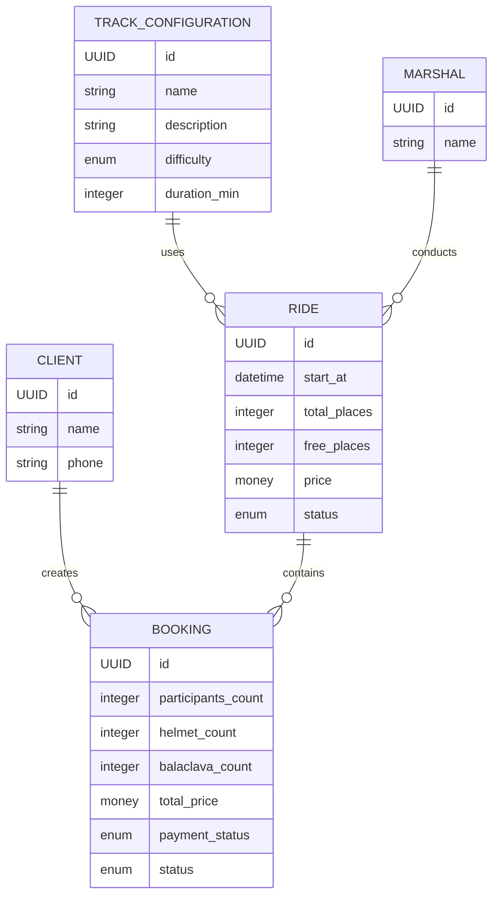
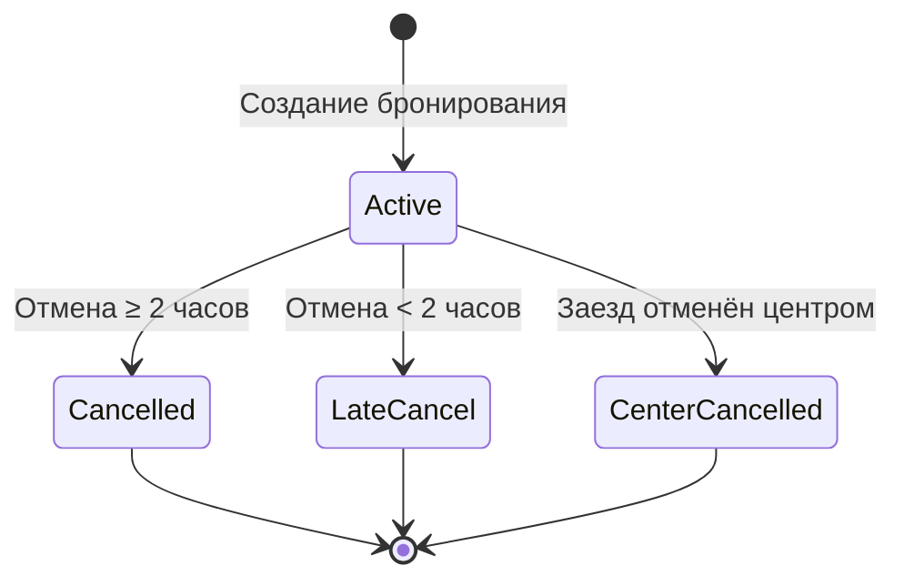

# Модель данных

> Этап 3. Проектирование. Описание сущностей, атрибутов и связей клиентского мобильного приложения.
>
> **Скоуп:** клиентское мобильное приложение и API для него.
> Документ описывает **ресурсную модель API**, а не структуру базы данных.
> Хранение данных, управление расписанием, логика бронирования и обработка бизнес-правил выполняются существующим сервером картинг-центра.
>
> - **TrackConfiguration, Marshal, Ride** — справочные сущности, доступные клиенту только для чтения.
> - **Client** и **Booking** — сущности, с которыми работает клиентское приложение.
> - Онлайн-оплата, управление расписанием, рейтинг маршалов и административные функции находятся вне текущего скоупа проекта.

---

# Сущности и атрибуты

## Client (Клиент)

Клиент — пользователь мобильного приложения, который может авторизоваться, просматривать расписание, оформлять и отменять бронирования.

| Атрибут | Тип | Описание |
| :-- | :-- | :-- |
| id | UUID (PK) | Уникальный идентификатор клиента |
| name | string | Имя клиента |
| phone | string (unique) | Номер телефона (используется для входа) |
| created_at | datetime | Дата регистрации |

### Особенности

- Авторизация выполняется по номеру телефона с подтверждением через SMS.
- При первом входе пользователь указывает имя.
- Один клиент может иметь несколько бронирований.
- Клиент может просматривать историю своих бронирований.

---

## TrackConfiguration (Конфигурация трассы)

Справочник конфигураций трассы, используемых картинг-центром.

Клиент не может создавать или изменять конфигурации.

| Атрибут | Тип | Описание |
| :-- | :-- | :-- |
| id | UUID (PK) | Идентификатор конфигурации |
| name | string | Название конфигурации |
| description | string | Краткое описание |
| difficulty | enum | Уровень сложности (детская, стандартная, спортивная) |
| duration_min | integer | Продолжительность заезда, мин |

### Особенности

Конфигурация определяет параметры заезда и отображается в карточке заезда.

---

## Marshal (Маршал)

Маршал отвечает за проведение заезда.

Является справочной сущностью существующей системы.

| Атрибут | Тип | Описание |
| :-- | :-- | :-- |
| id | UUID (PK) | Идентификатор маршала |
| name | string | Имя маршала |

### Особенности

Клиент видит маршала только как часть информации о заезде.

Редактирование данных маршала выполняется в существующей системе.

---

## Ride (Заезд)

Заезд — событие, на которое записывается клиент.

Заезды формируются существующей системой и доступны мобильному приложению только для чтения.

| Атрибут | Тип | Описание |
| :-- | :-- | :-- |
| id | UUID (PK) | Идентификатор заезда |
| configuration_id | FK → TrackConfiguration | Конфигурация трассы |
| marshal_id | FK → Marshal | Назначенный маршал |
| start_at | datetime | Дата и время начала |
| duration_min | integer | Продолжительность |
| total_places | integer | Общее количество мест |
| free_places | integer | Свободные места |
| price | money (RUB) | Стоимость одного места |
| helmet_rental | money (RUB) | Стоимость аренды шлема |
| balaclava_rental | money (RUB) | Стоимость аренды подшлемника |
| status | enum (scheduled / cancelled) | Статус заезда |

### Особенности

Заезд отображается в расписании.

Если статус имеет значение **cancelled**, оформление новых бронирований невозможно.

Количество свободных мест определяется сервером.

Клиент отображает только информацию, полученную через API.

---

## Booking (Бронирование)

Бронирование представляет запись клиента на выбранный заезд.

Одной записью можно оформить до четырёх мест.

| Атрибут | Тип | Описание |
| :-- | :-- | :-- |
| id | UUID (PK) | Идентификатор бронирования |
| ride_id | FK → Ride | Заезд |
| client_id | FK → Client | Клиент |
| participants_count | integer | Количество участников (1–4) |
| helmet_count | integer | Количество арендуемых шлемов |
| balaclava_count | integer | Количество арендуемых подшлемников |
| status | enum | active / cancelled / late_cancel / center_cancelled |
| total_price | money (RUB) | Итоговая стоимость бронирования |
| payment_status | enum | paid / unpaid |
| created_at | datetime | Дата создания |
| cancelled_at | datetime | Дата отмены |

### Особенности

Итоговая стоимость рассчитывается существующим сервером.

После подтверждения изменить количество участников или выбранную экипировку нельзя.

Для изменения параметров клиент отменяет существующее бронирование и создаёт новое.

При отмене заезда картинг-центром статус бронирования меняется на **center_cancelled**.

Клиент получает push-уведомление и видит обновлённый статус в разделе «Мои бронирования».
---

# Связи между сущностями

Модель данных клиентского приложения описывает только объекты, необходимые для просмотра расписания, оформления бронирований и работы с ними.

| Сущность | Связь | Сущность | Описание |
| :-- | :-- | :-- | :-- |
| Client | 1 → N | Booking | Один клиент может иметь несколько бронирований. |
| Ride | 1 → N | Booking | На один заезд может быть оформлено несколько бронирований разных клиентов. |
| TrackConfiguration | 1 → N | Ride | Одна конфигурация трассы может использоваться во многих заездах. |
| Marshal | 1 → N | Ride | Один маршал может проводить несколько заездов. |

---

# ER-диаграмма

---

# Модель состояний бронирования

Жизненный цикл бронирования определяется существующим сервером. Клиентское приложение отображает только текущее состояние бронирования и не изменяет его самостоятельно.

### Состояния бронирования

| Статус | Описание |
| :-- | :-- |
| **active** | Бронирование активно, клиент записан на выбранный заезд. |
| **cancelled** | Клиент отменил бронирование не позднее чем за 2 часа до начала. Место снова становится доступным для других клиентов. |
| **late_cancel** | Клиент отменил бронирование менее чем за 2 часа до начала. Бронирование считается поздней отменой, место не освобождается. |
| **center_cancelled** | Заезд отменён картинг-центром (например, по техническим причинам). Бронирование сохраняется в истории, клиент получает push-уведомление. |

---

# Инварианты модели

Независимо от сценария использования система должна соблюдать следующие ограничения:

- Один клиент может иметь несколько бронирований.
- Каждое бронирование относится только к одному заезду.
- Одной записью можно забронировать от **1 до 4 мест**.
- Количество свободных мест определяется существующим сервером.
- Создать бронирование при отсутствии свободных мест невозможно.
- После оформления бронирования изменить количество участников или выбранную экипировку нельзя. Для изменения необходимо отменить существующее бронирование и создать новое.
- При отмене более чем за **2 часа** место снова становится доступным.
- При отмене менее чем за **2 часа** место не освобождается.
- При отмене заезда картинг-центром все связанные бронирования получают статус **center_cancelled**.
- Повторная запись на заезд, отменённый картинг-центром, невозможна.
- Итоговая стоимость бронирования рассчитывается сервером и передаётся мобильному приложению через API.
- Клиентское приложение не хранит собственные данные о доступности мест и полностью полагается на ответы существующего сервера.