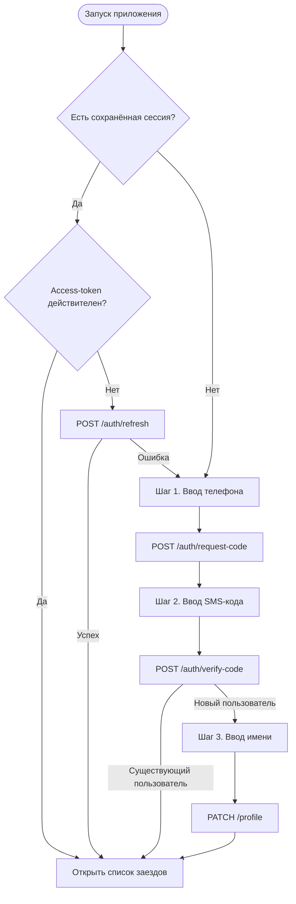

# OTP-авторизация и управление сессией

**ID:** LOGIC-001
**Тип:** Логика
**Домен:** 09. Логики
**Приоритет:** Critical
**Статус:** Черновик
**Функциональные блоки:** FB-AUTH-001 (Авторизация по телефону), FB-AUTH-002 (Управление сессией)

---

## История изменений

| Релиз | ТЗ           | Описание изменений                                    |
| ----- | ------------ | ----------------------------------------------------- |
| 0.1.0 | SCR-001-auth | Первичная версия логики для приложения картинг-центра |

---

# Обзор

Логика описывает процесс авторизации клиента по номеру телефона с подтверждением через SMS-код, а также управление пользовательской сессией.

После успешной проверки кода приложение сохраняет токены доступа в защищённом хранилище устройства и открывает экран со списком доступных заездов. При последующих запусках приложения сохранённая сессия позволяет автоматически авторизовать пользователя без повторного ввода SMS-кода. При завершении сессии токены удаляются, после чего для дальнейшей работы требуется повторная авторизация.

---

## User Story

> Как клиент картинг-центра, я хочу войти по номеру телефона и SMS-коду, чтобы быстро записаться на заезд без необходимости запоминать пароль.

---

## Бизнес-ценность

* быстрый и понятный вход без логина и пароля;
* единый сценарий авторизации для новых и существующих клиентов;
* сохранение сессии между запусками приложения;
* возможность сразу перейти к выбору подходящего заезда.

---

# Входные данные

| Название        | Тип                  | Возможные значения   | Описание                            |
| --------------- | -------------------- | -------------------- | ----------------------------------- |
| `phone`         | Состояние формы      | E.164                | Номер телефона клиента.             |
| `code`          | Состояние формы      | 4–6 цифр             | Код подтверждения из SMS.           |
| `name`          | Состояние формы      | 1–100 символов       | Имя клиента при первом входе.       |
| `access_token`  | Защищённое хранилище | JWT / отсутствует    | Токен доступа к API.                |
| `refresh_token` | Защищённое хранилище | строка / отсутствует | Токен обновления сессии.            |
| `expires_in`    | Ответ API            | целое число          | Время жизни access-token.           |
| `is_new`        | Ответ API            | `true` / `false`     | Признак первого входа пользователя. |

---

# Точки применения

| Экран               | Элемент               | Условие                          |
| ------------------- | --------------------- | -------------------------------- |
| SCR-001 Авторизация | Кнопка «Получить код» | Введён корректный номер телефона |
| SCR-001 Авторизация | Кнопка «Подтвердить»  | Введён SMS-код                   |
| SCR-001 Авторизация | Кнопка «Продолжить»   | Новый пользователь ввёл имя      |
| Запуск приложения   | Проверка сессии       | При каждом открытии приложения   |
| SCR-007 Профиль     | Кнопка «Выйти»        | Пользователь авторизован         |

---

# Флоу

---

# Описание логики

## Шаг 1. Проверка сохранённой сессии

При запуске приложения выполняется проверка наличия сохранённых токенов в защищённом хранилище устройства.

Если действующая сессия существует, экран авторизации пропускается, и пользователь сразу переходит к списку доступных заездов.

Если срок действия access-токена истёк, приложение автоматически пытается обновить его через refresh-токен без участия пользователя.

---

## Шаг 2. Получение SMS-кода

Пользователь вводит номер телефона.

После успешной локальной проверки номера приложение вызывает `requestAuthCode`.

При успешном ответе открывается экран ввода SMS-кода и запускается таймер повторной отправки.

---

## Шаг 3. Подтверждение кода

Пользователь вводит полученный SMS-код.

После успешной проверки сервер возвращает:

* access_token;
* refresh_token;
* expires_in;
* признак `is_new`.

Если пользователь уже зарегистрирован, приложение сохраняет токены и открывает список заездов.

Если пользователь новый, отображается дополнительный шаг ввода имени.

---

## Шаг 4. Завершение регистрации

Новый пользователь вводит имя.

После успешного вызова `updateProfile` регистрация считается завершённой, после чего открывается экран списка доступных заездов.

---

## Шаг 5. Завершение сессии

При выходе из аккаунта приложение вызывает `logout`, удаляет access_token и refresh_token из защищённого хранилища и возвращает пользователя на экран авторизации.

---

# API запросы

| Метод             | Использование                         |
| ----------------- | ------------------------------------- |
| `requestAuthCode` | Запрос SMS-кода                       |
| `verifyAuthCode`  | Проверка SMS-кода и получение токенов |
| `refreshToken`    | Обновление access-token               |
| `updateProfile`   | Сохранение имени нового пользователя  |
| `logout`          | Завершение пользовательской сессии    |

---

# Локальное хранение

| Ключ            | Тип хранения         | Назначение                             |
| --------------- | -------------------- | -------------------------------------- |
| `access_token`  | Keychain / Keystore  | Авторизация REST-запросов              |
| `refresh_token` | Keychain / Keystore  | Автоматическое обновление access-token |
| `expires_in`    | Защищённое хранилище | Контроль срока действия access-token   |

---

# Связанные требования

| ID      | Название                                   | Приоритет |
| ------- | ------------------------------------------ | --------- |
| FR-001  | Авторизация по номеру телефона             | Critical  |
| FR-002  | Регистрация нового пользователя            | Critical  |
| FR-003  | Управление пользовательской сессией        | Critical  |
| NFR-011 | Хранение токенов в защищённом хранилище ОС | Critical  |

---

# Критерии приёмки

| ID     | Критерий                                                                                                                                                                      |
| ------ | ----------------------------------------------------------------------------------------------------------------------------------------------------------------------------- |
| AC-001 | **Дано** сохранённой сессии нет, **Когда** пользователь открывает приложение, **Тогда** отображается экран авторизации.                                                       |
| AC-002 | **Дано** пользователь ввёл корректный номер телефона, **Когда** запрос `requestAuthCode` выполнен успешно, **Тогда** открывается экран ввода SMS-кода.                        |
| AC-003 | **Дано** пользователь ввёл корректный SMS-код, **Когда** `verifyAuthCode` возвращает успешный ответ, **Тогда** токены сохраняются, а пользователь переходит к списку заездов. |
| AC-004 | **Дано** пользователь новый (`is_new = true`), **Когда** он вводит имя и успешно выполняется `updateProfile`, **Тогда** регистрация завершается и открывается список заездов. |
| AC-005 | **Дано** access-token истёк, **Когда** доступен действующий refresh-token, **Тогда** приложение автоматически обновляет access-token без участия пользователя.                |
| AC-006 | **Дано** refresh-token недействителен, **Когда** обновление завершается ошибкой, **Тогда** токены удаляются и пользователь возвращается на экран авторизации.                 |
| AC-007 | **Дано** пользователь авторизован, **Когда** он выбирает действие «Выйти», **Тогда** токены удаляются из защищённого хранилища и открывается экран авторизации.               |

---

# Обработка ошибок

| Тип ошибки                        | Контекст                    | Действие                                                                                            |
| --------------------------------- | --------------------------- | --------------------------------------------------------------------------------------------------- |
| Неверный или просроченный SMS-код | `verifyAuthCode`            | Показать сообщение об ошибке, разрешить повторный ввод кода.                                        |
| Лимит отправки SMS                | `requestAuthCode`           | Запустить таймер повторной отправки, временно заблокировать повторный запрос.                       |
| Истёк access-token                | Любой авторизованный запрос | Автоматически выполнить `refreshToken` и повторить исходный запрос.                                 |
| Истёк refresh-token               | `refreshToken`              | Очистить сохранённую сессию и открыть экран авторизации.                                            |
| Ошибка сети                       | Любой запрос                | Показать сообщение о проблемах с подключением и предложить повторить действие.                      |
| Ошибка сервера (5xx)              | Любой запрос                | Показать универсальное сообщение об ошибке без завершения работы приложения.                        |
| Повторное нажатие на кнопку       | Любой этап авторизации      | Во время выполнения запроса повторные нажатия блокируются для предотвращения дублирования запросов. |

