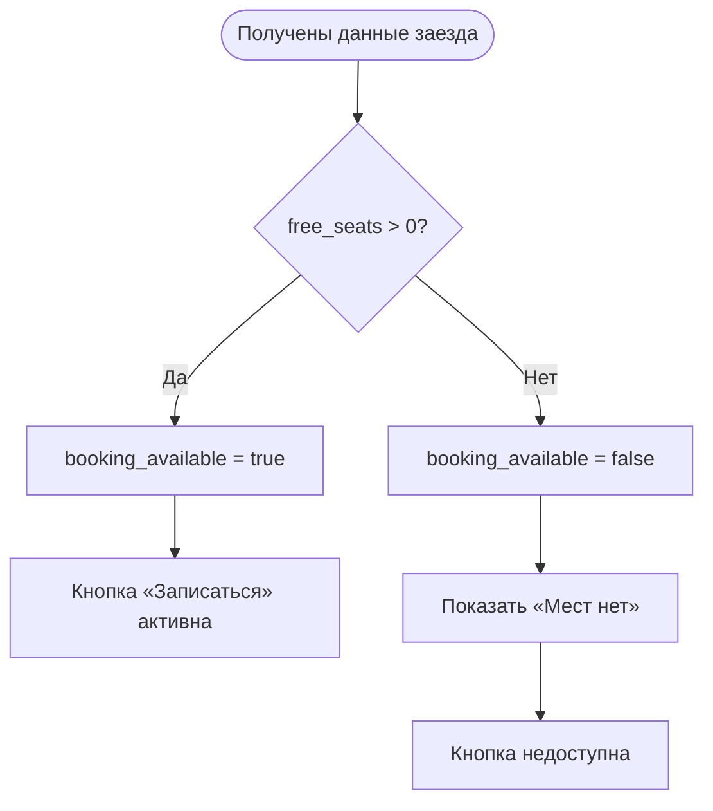

# Расчёт доступности заезда

**ID:** LOGIC-002
**Тип:** Логика
**Домен:** 09. Логики
**Приоритет:** Critical
**Статус:** Черновик
**Функциональные блоки:** FB-BOOKING-001 (Запись на заезд)

---

## История изменений

| Релиз | ТЗ | Описание изменений          |
| ----- | -- | --------------------------- |
| —     | —  | Первоначальная документация |

---

## Обзор

Логика определяет, доступна ли запись на выбранный заезд. Решение принимается на основании количества свободных мест, полученного вместе с данными заезда.

Логика не выполняет собственных запросов, а использует уже загруженные данные. Окончательное подтверждение доступности выполняет сервер при создании записи.

### User Story

> Как клиент, я хочу сразу видеть, доступна ли запись на выбранный заезд, чтобы не тратить время на оформление записи, если свободных мест уже нет.

### Бизнес-ценность

* Исключает попытки записи на полностью заполненные заезды.
* Делает интерфейс понятнее.
* Уменьшает количество ошибок при создании записи.

---

## Входные данные

| Название            | Тип                   | Возможные значения | Описание                                                    |
| ------------------- | --------------------- | ------------------ | ----------------------------------------------------------- |
| `free_seats`        | Данные заезда         | `0…N`              | Количество свободных мест на выбранный заезд.               |
| `booking_available` | Производное состояние | `true` / `false`   | Признак доступности записи. Рассчитывается по `free_seats`. |

---

## Точки применения

| Экран/Компонент                                     | Элемент/Триггер             | Условие                      |
| --------------------------------------------------- | --------------------------- | ---------------------------- |
| [SCR-003 Детали заезда](../SCR-003-ride-details.md) | Кнопка «Записаться»         | После загрузки данных заезда |
| [SCR-003 Детали заезда](../SCR-003-ride-details.md) | Бейдж «Мест нет»            | Если `free_seats = 0`        |
| [SCR-004 Запись на заезд](../SCR-004-booking.md)    | Проверка доступности записи | При открытии экрана          |

---

## Флоу

---

## Описание логики

### Шаг 1. Определение доступности записи

После загрузки данных заезда приложение анализирует значение `free_seats`.

Если количество свободных мест больше нуля, запись считается доступной.

Если свободных мест нет, запись становится недоступной.

---

### Шаг 2. Отображение состояния

При доступной записи:

* кнопка «Записаться» активна;
* пользователь может перейти к оформлению записи.

При отсутствии свободных мест:

* отображается бейдж «Мест нет»;
* кнопка «Записаться» недоступна.

---

### Шаг 3. Повторная проверка сервером

Перед созданием записи сервер повторно проверяет наличие свободных мест.

Если за время между просмотром карточки и подтверждением записи место занял другой клиент, сервер отклоняет запрос.

Приложение обновляет данные заезда и отображает актуальное состояние доступности.

---

## API

> Логика не выполняет отдельных запросов и использует данные, полученные при загрузке информации о заезде.

| Источник        | Поле                 | Использование                           |
| --------------- | -------------------- | --------------------------------------- |
| `getSlot`       | `free_seats`         | Определение доступности записи          |
| `createBooking` | результат выполнения | Финальная проверка доступности сервером |

---

## Связанные требования

| ID    | Название                    | Приоритет |
| ----- | --------------------------- | --------- |
| FR-XX | Просмотр доступности заезда | High      |
| FR-XX | Запись на заезд             | Critical  |

---

## Критерии приёмки

| ID     | Критерий                                                                                                                                                                                                                     |
| ------ | ---------------------------------------------------------------------------------------------------------------------------------------------------------------------------------------------------------------------------- |
| AC-001 | **Дано** у заезда есть свободные места (`free_seats > 0`), **Когда** пользователь открывает карточку заезда, **Тогда** кнопка «Записаться» активна.                                                                          |
| AC-002 | **Дано** свободных мест нет (`free_seats = 0`), **Когда** пользователь открывает карточку заезда, **Тогда** отображается бейдж «Мест нет», а кнопка «Записаться» недоступна.                                                 |
| AC-003 | **Дано** свободные места закончились после открытия экрана, **Когда** пользователь подтверждает запись, **Тогда** сервер отклоняет запрос, приложение обновляет данные заезда и отображает актуальное состояние доступности. |

---

## Обработка ошибок

| Тип ошибки                    | Контекст                                                              | Действие                                                                                                                                                         |
| ----------------------------- | --------------------------------------------------------------------- | ---------------------------------------------------------------------------------------------------------------------------------------------------------------- |
| Заезд стал недоступен         | Между загрузкой данных и созданием записи свободные места закончились | Сервер отклоняет запрос. Приложение повторно загружает данные заезда, показывает актуальное количество свободных мест и обновляет состояние кнопки «Записаться». |
| Ошибка загрузки данных заезда | Не удалось получить данные `getSlot`                                  | Отображается экран ошибки с возможностью повторной загрузки.                                                                                                     |
| Ошибка сети                   | Отсутствует соединение при загрузке данных                            | Отображается сообщение об ошибке и возможность повторить запрос после восстановления соединения.                                                                 |

