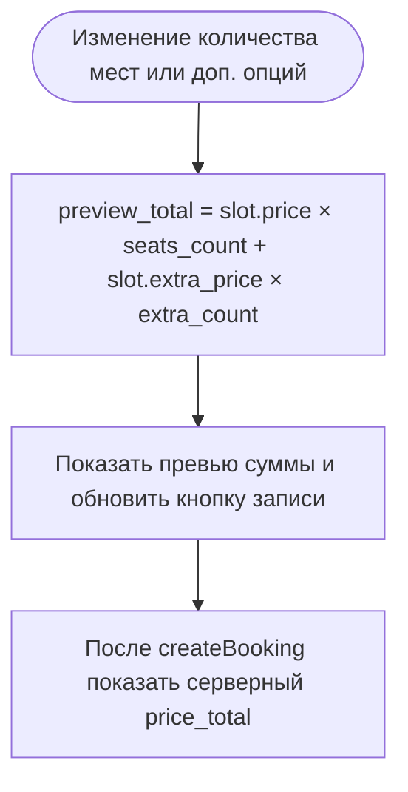

# Расчёт цены брони

**ID:** LOGIC-003  
**Тип:** Логика  
**Домен:** 09. Логики  
**Приоритет:** High  
**Статус:** Черновик  
**Функциональные блоки:** FB-BOOKING-001

---

## История изменений

| Релиз | ТЗ | Описание изменений |
|-------|-----|-------------------|
| 0.1.0 | SCR-004-booking | Логика цены адаптирована под сценарий записи в картинг-центр |

---

## Обзор

Логика отвечает за расчёт стоимости брони на заезд. До подтверждения пользователя показывается превью суммы, а после успешного создания записи экран показывает итог из ответа сервера.

### User Story

> Как клиент, я хочу видеть итоговую стоимость заранее, чтобы понимать сумму и не удивляться после подтверждения.

### Бизнес-ценность

- Делает сценарий записи прозрачным.
- Снижает количество вопросов в поддержку.
- Поддерживает офлайн-оплату и понятную сумму до входа в центр.

---

## Входные данные

| Название | Тип | Возможные значения | Описание |
|----------|-----|-------------------|----------|
| `slot.price` | Данные слота | число | Цена за одно место на выбранный заезд. |
| `slot.extra_price` | Данные слота | число | Цена за дополнительную опцию / экипировку. |
| `seats_count` | Состояние формы | 1…N | Количество мест в текущей броне. |
| `extra_count` | Состояние формы | 0…seats_count | Количество мест с доп. опцией. |
| `price_total` | Ответ сервера | число | Итоговая сумма уже созданной брони. |

---

## Точки применения

| Экран/Компонент | Элемент/Триггер | Условие |
|-----------------|-----------------|---------|
| [SCR-004-booking.md](../SCR-004-booking.md) | Блок цены и кнопка записи | На экране оформления |
| [BS-002-booking-confirm.md](../BS-002-booking-confirm.md) | Сводка суммы | После успешной брони |
| [SCR-005-my-bookings.md](../SCR-005-my-bookings.md) | Карточка брони | В списке записей |
| [SCR-006-booking-details.md](../SCR-006-booking-details.md) | Детали брони | На странице деталей |

---

## Флоу

---

## Описание логики

### Шаг 1: Превью суммы до подтверждения

На экране оформления брони сумма считается в реальном времени по формуле:

$$preview\_total = slot.price \times seats\_count + slot.extra\_price \times extra\_count$$

Если услуга не требует доп. опции, строка с доп. стоимостью скрывается.

### Шаг 2: Отображение в UI

Блок цены показывает:
- стоимость мест;
- стоимость доп. опций (если выбраны);
- итоговую сумму.

Одинаковая сумма дублируется на кнопке записи.

### Шаг 3: Итог уже созданной брони

После успешной записи экран подтверждения и детали брони показывают серверный `price_total`. Клиент не пересчитывает эту сумму заново, а использует данные из ответа API.

### Шаг 4: Граничные случаи

Если цена равна 0, это валидный сценарий и итог отображается как «0 ₽». Если цена не пришла или пришла некорректно, сумма не показывается и кнопка записи блокируется.

---

## API запросы

> Логика не инициирует отдельный запрос, но использует данные из ответов экранов.

| Источник | Поля | Использование |
|----------|------|---------------|
| `getSlot` | `slot.price`, `slot.extra_price` | Превью стоимости до создания брони |
| `createBooking` / `getBooking` / `listBookings` | `price_total` | Показ итоговой суммы после создания брони |

---

## Связанные требования

| ID | Название | Приоритет |
|----|----------|-----------|
| FT-012 | Понятная стоимость записи | High |
| FT-013 | Оплата на месте | High |

---

## Критерии приёмки

| ID | Критерий |
|----|----------|
| AC-001 | Дано пользователь меняет число мест, Когда форма пересчитывается, Тогда сумма обновляется сразу и без дополнительного действия. |
| AC-002 | Дано бронь уже создана, Когда пользователь открывает подтверждение или детали, Тогда он видит итог из серверного `price_total`. |
| AC-003 | Дано цена не пришла, Когда пользователь открывает экран, Тогда сумма не показывается и запись невозможна. |

---
