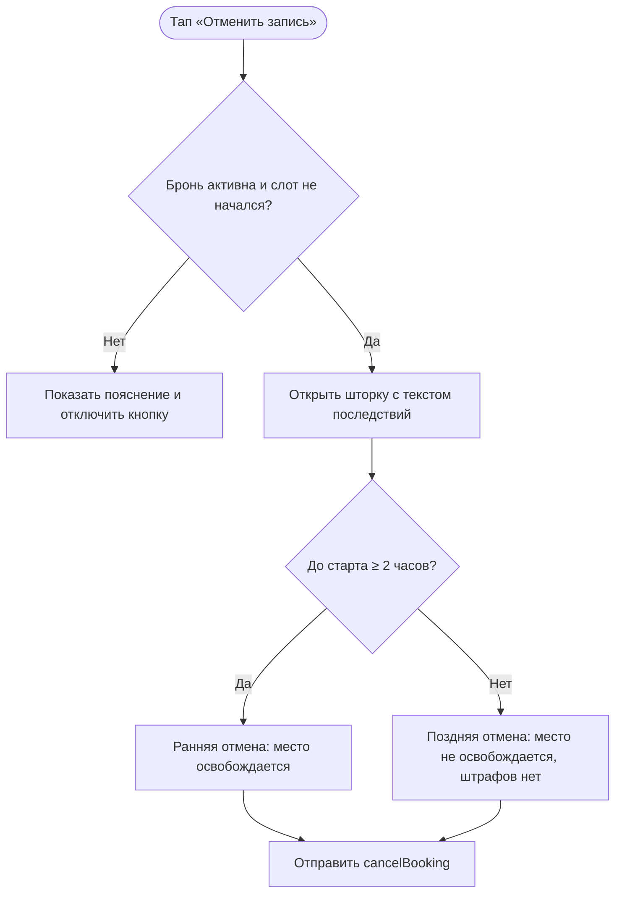

# Отмена брони: правило 2 часов

**ID:** LOGIC-004  
**Тип:** Логика  
**Домен:** 09. Логики  
**Приоритет:** Critical  
**Статус:** Черновик  
**Функциональные блоки:** FB-BOOKING-001

---

## История изменений

| Релиз | ТЗ | Описание изменений |
|-------|-----|-------------------|
| 0.1.0 | BS-004-cancel-confirm | Логика адаптирована под сценарий отмены в приложении картинг-центра |

---

## Обзор

Логика описывает, как клиент отменяет бронь и как приложение применяет правило 2 часов до старта заезда. Она нужна для честного предупреждения пользователя и для корректного обновления статуса записи.

### User Story

> Как клиент, я хочу понимать последствия отмены, чтобы решить, стоит ли отменять запись, и не потерять время на лишние вопросы.

### Бизнес-ценность

- Делает правила отмены прозрачными.
- Помогает не терять места зря при ранней отмене.
- Уменьшает количество конфликтов и вопросов в поддержку.

---

## Входные данные

| Название | Тип | Возможные значения | Описание |
|----------|-----|-------------------|----------|
| `booking.status` | Данные брони | active / cancelled / late_cancel | Текущий статус записи. |
| `slot.start_at` | Данные слота | дата/время | Время старта заезда. |
| `now` | Состояние устройства | дата/время | Текущее время, используемое для предварительной оценки. |

---

## Точки применения

| Экран/Компонент | Элемент/Триггер | Условие |
|-----------------|-----------------|---------|
| [SCR-006-booking-details.md](../SCR-006-booking-details.md) | Кнопка «Отменить запись» | Бронь активна и слот ещё не начался |
| [BS-004-cancel-confirm.md](../BS-004-cancel-confirm.md) | Шторка подтверждения отмены | При попытке отмены |

---

## Флоу

---

## Описание логики

### Шаг 1: Доступность отмены

Кнопка отмены активна только для активной брони, пока слот ещё не начался. Если заезд уже начался или запись уже отменена, кнопка отключается и экран показывает короткое пояснение.

### Шаг 2: Предварительный расчёт варианта отмены

Перед подтверждением приложение сравнивает время до старта с порогом 2 часов. Если до старта остаётся 2 часа и больше, показывается текст ранней отмены. Если меньше 2 часов — текст поздней отмены.

### Шаг 3: Подтверждение действия

После тапa по подтверждению кнопка блокируется, и отправляется запрос на отмену. Для пользователя это выглядит как короткая загрузка и отсутствие повторной отправки.

### Шаг 4: Результат

Если сервер возвращает раннюю отмену, бронь становится отменённой и место освобождается. Если поздняя отмена, бронь также считается отменённой, но место не освобождается и штрафов нет.

---

## API запросы

### cancelBooking

**Тип:** REST  
**Метод:** POST  
**Спецификация:** [../api/bookings/api.yaml](../api/bookings/api.yaml) → `cancelBooking`

**Триггер:** Подтверждение отмены в шторке.

**Обработка ответа:**

| Результат | Действие |
|-----------|----------|
| Успех | Обновить статус брони и закрыть шторку |
| 422 `slot_started` | Показать, что отмена недоступна |
| 409 `already_cancelled` | Показать, что бронь уже отменена |

---

## Связанные требования

| ID | Название | Приоритет |
|----|----------|-----------|
| FT-018 | Ранняя отмена | High |
| FT-019 | Поздняя отмена без штрафа | High |
| FT-020 | Предупреждение перед поздней отменой | High |

---

## Критерии приёмки

| ID | Критерий |
|----|----------|
| AC-001 | Дано до старта больше 2 часов, Когда пользователь подтверждает отмену, Тогда бронь отменяется как ранняя и место освобождается. |
| AC-002 | Дано до старта меньше 2 часов, Когда пользователь подтверждает отмену, Тогда бронь отменяется как поздняя и место не освобождается. |
| AC-003 | Дано заезд уже начался, Когда пользователь открывает бронь, Тогда кнопка отмены отключена. |

