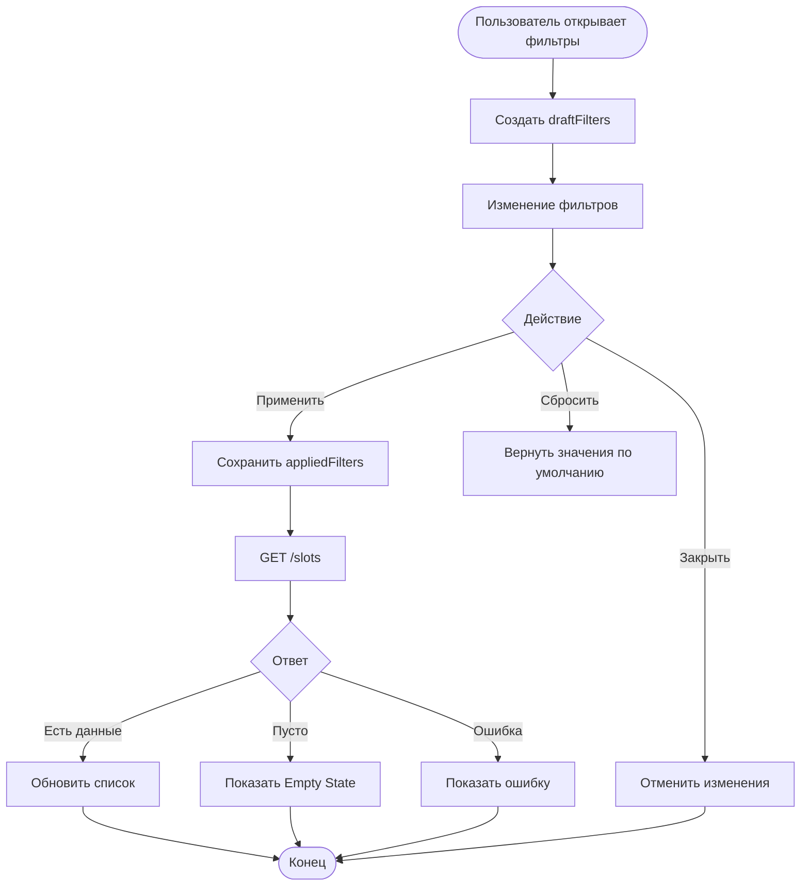

---

# Фильтрация списка заездов

**ID:** LOGIC-005
**Тип:** Логика
**Домен:** 09. Логики
**Приоритет:** High
**Статус:** Черновик
**Функциональные блоки:** FB-RIDES-001 (Фильтрация), FB-RIDES-002 (Обновление списка)

---

## История изменений

| Релиз | ТЗ | Описание изменений          |
| ----- | -- | --------------------------- |
| —     | —  | Первоначальная документация |

---

## Входные данные

Логика использует состояние выбранных фильтров. Различаются два набора данных:

* **применённые фильтры** — используются для отображения списка заездов на SCR-002;
* **черновик фильтров** — используется внутри BS-001 и применяется только после нажатия кнопки «Применить».

| Название         | Тип       | Возможные значения | Описание                                        |
| ---------------- | --------- | ------------------ | ----------------------------------------------- |
| `appliedFilters` | Состояние | объект фильтров    | Применённые фильтры списка заездов.             |
| `draftFilters`   | Состояние | объект фильтров    | Черновик фильтров внутри BS-001.                |
| `date_from`      | Состояние | дата / отсутствует | Начало периода поиска.                          |
| `date_to`        | Состояние | дата / отсутствует | Конец периода поиска.                           |
| `only_available` | Состояние | `true` / `false`   | Показывать только заезды со свободными местами. |

По умолчанию фильтры не заданы:

* `date_from = null`
* `date_to = null`
* `only_available = false`

---

# Обзор

Логика отвечает за фильтрацию списка доступных заездов.

Пользователь может выбрать период дат и включить отображение только заездов со свободными местами. После применения фильтров список обновляется, а при отсутствии подходящих заездов отображается состояние Empty.

### User Story

> Как клиент, я хочу отфильтровать список заездов по дате и наличию свободных мест, чтобы быстрее найти подходящий сеанс.

### Бизнес-ценность

* Ускоряет поиск подходящего времени.
* Уменьшает количество ненужных просмотров.
* Делает расписание более удобным.

---

# Точки применения

| Экран                  | Элемент            | Условие                                   |
| ---------------------- | ------------------ | ----------------------------------------- |
| SCR-002 Список заездов | Кнопка «Фильтры»   | Открытие BS-001                           |
| BS-001 Фильтры         | Кнопка «Применить» | Обновление списка                         |
| BS-001 Фильтры         | Кнопка «Сбросить»  | Возврат фильтров к значениям по умолчанию |
| SCR-002 Список заездов | Pull-to-refresh    | Повторная загрузка списка                 |

---

# Флоу

---

# Описание логики

### Шаг 1. Открытие фильтров

При открытии BS-001 создаётся копия текущих фильтров (`draftFilters`).

Изменения не влияют на список заездов до нажатия кнопки «Применить».

---

### Шаг 2. Изменение фильтров

Пользователь может:

* выбрать диапазон дат;
* включить отображение только свободных мест.

Все изменения сохраняются только в `draftFilters`.

---

### Шаг 3. Применение

После нажатия «Применить»:

* `draftFilters` копируются в `appliedFilters`;
* шторка закрывается;
* выполняется запрос списка заездов;
* список обновляется.

---

### Шаг 4. Сброс

Кнопка «Сбросить»:

* возвращает фильтры к значениям по умолчанию;
* список обновляется только после нажатия «Применить».

---

### Шаг 5. Отмена

Если пользователь закрывает BS-001 без применения:

* изменения отменяются;
* список остаётся без изменений.

---

# API запросы

## GET /slots

**Триггер:** открытие SCR-002, применение фильтров, обновление списка.

### Query

| Параметр         | Тип  | Источник       |
| ---------------- | ---- | -------------- |
| `date_from`      | date | appliedFilters |
| `date_to`        | date | appliedFilters |
| `only_available` | bool | appliedFilters |

### Обработка ответа

| Результат   | Действие                                       |
| ----------- | ---------------------------------------------- |
| Loading     | Показать skeleton списка                       |
| 200         | Отобразить список заездов                      |
| 200 (пусто) | Empty State                                    |
| 4xx         | Сообщение об ошибке                            |
| 5xx         | Сообщение «Произошла ошибка. Попробуйте позже» |
| Нет сети    | Сообщение «Проверьте подключение к интернету»  |

---

# Связанные требования

### Функциональные (REQ-FUNC-*)

| ID           | Название                                                   | Приоритет |
| ------------ | ---------------------------------------------------------- | --------- |
| REQ-FUNC-001 | Пользователь может фильтровать список заездов по периоду   | High      |
| REQ-FUNC-002 | Пользователь может отображать только свободные заезды      | High      |
| REQ-FUNC-003 | После применения фильтров список обновляется автоматически | High      |

### Интеграции (REQ-INT-*)

| ID          | Название                                    | Приоритет |
| ----------- | ------------------------------------------- | --------- |
| REQ-INT-001 | Получение списка заездов через API `/slots` | High      |

### UI (REQ-UI-*)

| ID         | Название                                            | Приоритет |
| ---------- | --------------------------------------------------- | --------- |
| REQ-UI-001 | Активные фильтры отображаются на экране списка      | Medium    |
| REQ-UI-002 | При отсутствии результатов отображается Empty State | Medium    |

---

# Критерии приёмки

| ID     | Критерий                                                                                                                                            |
| ------ | --------------------------------------------------------------------------------------------------------------------------------------------------- |
| AC-001 | **Дано** пользователь открыл BS-001, **Когда** он меняет фильтры, **Тогда** изменения сохраняются только в `draftFilters`.                          |
| AC-002 | **Дано** пользователь нажал «Применить», **Когда** фильтры сохранены, **Тогда** выполняется запрос списка заездов и отображаются новые данные.      |
| AC-003 | **Дано** пользователь нажал «Сбросить», **Когда** затем нажал «Применить», **Тогда** отображаются все доступные заезды без фильтрации.              |
| AC-004 | **Дано** по выбранным фильтрам нет заездов, **Когда** API вернул пустой список, **Тогда** отображается Empty State с предложением изменить фильтры. |
| AC-005 | **Дано** пользователь закрыл шторку без применения, **Когда** он возвращается к списку, **Тогда** список остаётся без изменений.                    |

---

# Обработка ошибок

| Тип ошибки       | Контекст                  | Действие                                                |
| ---------------- | ------------------------- | ------------------------------------------------------- |
| Ошибка сети      | Получение списка заездов  | Показать сообщение об ошибке и кнопку «Повторить»       |
| Ошибка сервера   | API `/slots`              | Показать сообщение «Произошла ошибка. Попробуйте позже» |
| Пустой результат | После применения фильтров | Отобразить Empty State с возможностью изменить фильтры  |
