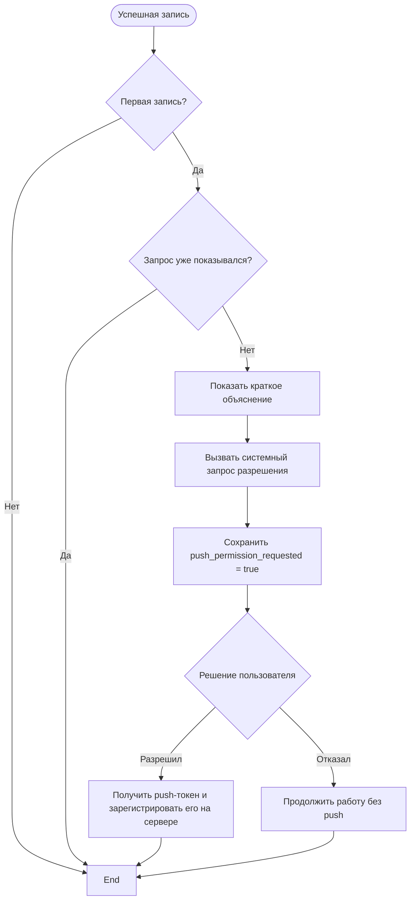

---

# Запрос разрешения на push-уведомления

**ID:** LOGIC-007
**Тип:** Логика
**Домен:** 09. Логики
**Приоритет:** Medium
**Статус:** Черновик
**Функциональные блоки:** FB-NOTIFY-001 (Напоминания о заезде), FB-BOOKING-003 (Завершение записи)

---

## Обзор

LOGIC-007 определяет момент, когда приложение запрашивает у пользователя разрешение на получение push-уведомлений.

Запрос показывается **только после первой успешной записи на заезд**, когда пользователь уже получил ценность приложения и понимает, зачем нужны уведомления. Разрешение не запрашивается при первом запуске приложения, во время авторизации или в профиле.

После согласия приложение получает push-токен устройства и регистрирует его на сервере. После этого сервер может отправлять пользователю:

* напоминания о предстоящем заезде;
* уведомления об изменении времени заезда;
* уведомления об отмене записи.

Если пользователь отказался, приложение продолжает работать без ограничений. Запрос повторно не показывается.

---

## User Story

> Как клиент картинг-центра, я хочу получать напоминания о предстоящем заезде, чтобы не забыть приехать вовремя.

---

## Бизнес-ценность

* снижение количества неявок;
* своевременное информирование клиента;
* более высокая вероятность получения разрешения благодаря запросу после успешной записи;
* отсутствие навязчивых повторных запросов.

---

## Входные данные

| Название                    | Тип                  | Описание                                       |
| --------------------------- | -------------------- | ---------------------------------------------- |
| `is_first_booking`          | Ответ API            | Признак первой успешной записи пользователя    |
| `push_permission_requested` | Локальное состояние  | Был ли уже показан системный запрос разрешения |
| `system_push_status`        | Состояние ОС         | `not_determined`, `authorized`, `denied`       |
| `push_token`                | Системный API        | Push-токен устройства                          |
| `platform`                  | Состояние приложения | `ios` или `android`                            |

---

## Точки применения

| Экран                    | Триггер                               | Условие                                               |
| ------------------------ | ------------------------------------- | ----------------------------------------------------- |
| BS-002 «Успешная запись» | После отображения информации о записи | Только если первая запись и запрос ещё не показывался |

Запрос не отображается:

* на экране авторизации;
* на главном экране;
* в профиле;
* при повторных записях.

---

## Флоу



---

## Описание логики

### Шаг 1. Проверка условий

После успешной записи приложение проверяет:

* является ли запись первой;
* показывался ли ранее запрос разрешения.

Если хотя бы одно условие не выполнено, запрос не отображается.

---

### Шаг 2. Подготовка пользователя

Перед системным диалогом отображается короткое сообщение.

Например:

> Получайте напоминания о предстоящем заезде и уведомления об изменениях расписания.

---

### Шаг 3. Системный запрос

Вызывается системный запрос операционной системы на получение разрешения отправлять push-уведомления.

После вызова запроса локально сохраняется флаг

```
push_permission_requested = true
```

чтобы запрос больше не показывался.

---

### Шаг 4. Пользователь разрешил уведомления

Если пользователь разрешил получение push-уведомлений:

* приложение получает push-токен устройства;
* отправляет его на сервер;
* сервер использует токен для отправки уведомлений.

---

### Шаг 5. Пользователь отказался

Если пользователь отказался:

* запись остаётся созданной;
* функциональность приложения не ограничивается;
* push-токен не регистрируется;
* повторный запрос не отображается.

При необходимости пользователь может включить уведомления позже через настройки операционной системы.

---

## API

### Регистрация push-токена

**Метод:** POST

```
/auth/push-tokens
```

Передаваемые данные:

| Поле     | Тип           |
| -------- | ------------- |
| token    | string        |
| platform | ios / android |

---

### Удаление push-токена

**Метод:** DELETE

```
/auth/push-tokens
```

Используется при выходе пользователя из аккаунта или отключении уведомлений.

---

## Критерии приёмки

| ID     | Критерий                                                                                |
| ------ | --------------------------------------------------------------------------------------- |
| AC-001 | После первой успешной записи отображается запрос разрешения на push-уведомления.        |
| AC-002 | При повторных записях запрос не отображается.                                           |
| AC-003 | После согласия пользователя приложение регистрирует push-токен на сервере.              |
| AC-004 | После отказа запись остаётся успешной и приложение продолжает работать без ограничений. |
| AC-005 | Запрос разрешения отображается только один раз.                                         |
| AC-006 | После повторного запуска приложения запрос не появляется повторно.                      |
| AC-007 | Пользователь может включить уведомления позже через настройки операционной системы.     |

---

## Обработка ошибок

| Ошибка                                 | Действие                                                                             |
| -------------------------------------- | ------------------------------------------------------------------------------------ |
| Пользователь отказал в разрешении      | Продолжить работу приложения без push-уведомлений                                    |
| Ошибка получения push-токена           | Не показывать ошибку пользователю, повторить регистрацию позже                       |
| Ошибка регистрации токена на сервере   | Не блокировать приложение, повторить отправку при следующем запуске                  |
| Ошибка сети                            | Продолжить работу приложения, зарегистрировать токен после восстановления соединения |
| Push отключены в настройках устройства | Работать без push-уведомлений, повторный запрос не показывать                        |

Такой вариант полностью соответствует тематике картинг-центра «Апекс», сохраняет необходимую архитектурную логику и при этом примерно вдвое компактнее исходного документа.
