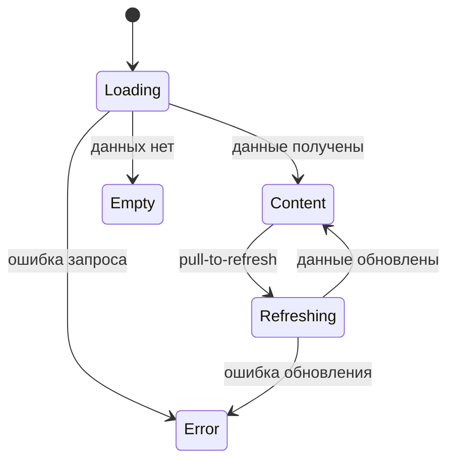

# Паттерн состояний экрана

**ID:** LOGIC-008  
**Тип:** Логика  
**Домен:** 09. Логики  
**Приоритет:** High  
**Статус:** Черновик  
**Функциональные блоки:** FB-UI-STATES-001

---

## История изменений

| Релиз | ТЗ | Описание изменений |
|-------|-----|-------------------|
| 0.1.0 | Общий UI-паттерн | Логика адаптирована под мобильное приложение картинг-центра |

---

## Обзор

Логика задаёт единый паттерн состояний для всех экранов приложения: загрузка, контент, пустое состояние и ошибка. Он помогает пользователю понимать, что происходит на экране, и не терять контекст при сетевых проблемах.

### User Story

> Как клиент, я хочу понимать, что происходит на экране — загружается ли контент, пустой ли он или произошла ошибка.

### Бизнес-ценность

- Делает интерфейс предсказуемым.
- Снижает чувство «приложение зависло».
- Улучшает восприятие и доступность интерфейса.

---

## Входные данные

| Название | Тип | Возможные значения | Описание |
|----------|-----|-------------------|----------|
| `requestStatus` | Состояние | loading / success / empty / error | Статус загрузки данных. |
| `isRefreshing` | Состояние | true / false | Тянется ли pull-to-refresh. |
| `actionStatus` | Состояние | idle / submitting | Статус кнопки действия. |

---

## Точки применения

| Экран/Компонент | Элемент/Триггер | Условие |
|-----------------|-----------------|---------|
| Все экраны с запросами | Загрузка, обновление, ошибки | На всех экранах с данными из API |

---

## Флоу

---

## Описание логики

### Шаг 1: Loading

Во время первой загрузки показывается скелетон или шиммер, чтобы пользователь видел, что экран заполняется.

### Шаг 2: Content

Если данные получены, показывается основной контент экрана.

### Шаг 3: Empty

Если данных нет, отображается пустое состояние с подсказкой, что сделать дальше.

### Шаг 4: Error

Если запрос завершился с ошибкой, показывается нейтральная заглушка с кнопкой «Обновить».

### Шаг 5: Действия

Когда пользователь отправляет форму или подтверждает действие, кнопка показывает лоадер и блокируется до завершения запроса.

---

## Связанные требования

| ID | Название | Приоритет |
|----|----------|-----------|
| NFR-001 | Понятные состояния экрана | High |
| NFR-002 | Понятная обработка ошибок | High |

---

## Критерии приёмки

| ID | Критерий |
|----|----------|
| AC-001 | Дано экран загружается, Когда данные ещё не пришли, Тогда показывается скелетон. |
| AC-002 | Дано запрос завершился ошибкой, Когда пользователь видит экран, Тогда показывается состояние ошибки с кнопкой «Обновить». |
| AC-003 | Дано данных нет, Когда экран открывается, Тогда показывается пустое состояние с подсказкой. |
| AC-004 | Дано пользователь отправил действие, Когда запрос выполняется, Тогда кнопка блокируется и показывает лоадер. |

