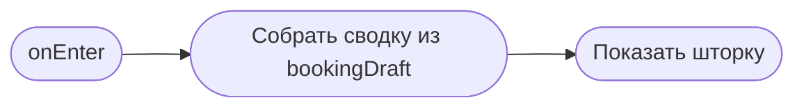

# Подтверждение записи

**ID:** BS-002  
**Тип:** Bottom Sheet  
**Домен:** 02. Запись на слот  
**Приоритет:** High  
**Статус:** Черновик  
**Функциональные блоки:** FB-BOOKING-001, FB-BOOKING-002  
**Зона авторизации:** АЗ  
**Дизайн-макет:** [BS-002-booking-confirm.md](../3-design-brief/BS-002-booking-confirm.md)

---

## Содержание

- [История изменений](#история-изменений)
- [Обзор](#обзор)
- [Навигация](#навигация)
- [Входные данные](#входные-данные)
- [Применяемые логики](#применяемые-логики)
- [Свойства Bottom Sheet](#свойства-bottom-sheet)
- [Инициализация](#инициализация)
- [Используемые запросы](#используемые-запросы)
- [Макет экрана](#макет-экрана)
- [Элементы экрана](#элементы-экрана)
- [Состояния экрана](#состояния-экрана)
- [Действия пользователя](#действия-пользователя)
- [Связанные требования](#связанные-требования)
- [Критерии приёмки](#критерии-приёмки)

---

## История изменений

| Релиз | ТЗ | Описание изменений |
|-------|-----|-------------------|
| 0.1.0 | BS-002 | Первичная спецификация шторки подтверждения записи |

---

## Обзор

Шторка показывает клиенту итог бронирования перед отправкой запроса на создание записи. Она нужна, чтобы пользователь мог убедиться в стоимости, деталях заезда и условиях оплаты до финального подтверждения.

### User Story

> Как клиент картинг-центра, я хочу увидеть итог записи и подтвердить бронь, чтобы не ошибиться при выборе места и цены.

### Бизнес-ценность

- Снижает риск ошибочной брони.
- Повышает доверие к приложению.
- Делает сценарий записи понятным и прозрачным.

---

## Навигация

### Входящая

| Источник | Триггер | Условие | Передаваемые параметры |
|----------|---------|---------|------------------------|
| [SCR-004-booking.md](SCR-004-booking.md) | Тап «Продолжить» / «К подтверждению» | Есть валидная форма брони | `bookingDraft` |

### Исходящая

| Назначение | Триггер | Передаваемые параметры |
|------------|---------|------------------------|
| [BS-003-booking-success.md](BS-003-booking-success.md) | Успешное создание брони | `booking` |
| [SCR-004-booking.md](SCR-004-booking.md) | Отмена / возврат к редактированию | — |

---

## Входные данные

| Название | Тип | Возможные значения | Описание |
|----------|-----|-------------------|----------|
| `bookingDraft` | Состояние | объект | Данные выбранного слота, количества мест, досок и цены. |
| `priceTotal` | Производное | число | Итоговая сумма, которую клиент должен увидеть до подтверждения. |
| `bookingResult` | Состояние | объект | Ответ после создания брони. |

---

## Применяемые логики

| Логика | Элемент/Триггер | Описание |
|--------|-----------------|----------|
| Расчёт цены брони | Просмотр сводки | Показ итоговой суммы из выбранных параметров. |
| Паттерн состояний экрана | Подтверждение / ошибка / загрузка | Loading / Content / Error. |

---

## Свойства Bottom Sheet

| Свойство | Значение |
|----------|----------|
| Высота | Динамическая |
| Закрытие свайпом | Да |
| Закрытие по тапу вне области | Да |
| Затемнение фона | Да |
| Кнопка закрытия | Да |

---

## Инициализация

### Диаграмма загрузки



### Запросы при открытии

| № | Запрос | Критичный | Зависит от | Условие |
|---|--------|-----------|------------|---------|
| — | Сетевые запросы при открытии не выполняются | — | — | Данные уже доступны в контексте |

---

## Используемые запросы

### createBooking

**Тип:** REST  
**Метод:** POST  
**Спецификация:** [../api/bookings/api.yaml](../api/bookings/api.yaml) → `createBooking`

**Триггер:** Тап на кнопку «Подтвердить запись».

**Параметры:**

| Параметр | Тип | Обязательность | Источник | Описание |
|----------|-----|----------------|----------|----------|
| `slotId` | string | Да | `bookingDraft.slotId` | Идентификатор выбранного слота. |
| `seatsCount` | integer | Да | `bookingDraft.seatsCount` | Число мест. |
| `rentalCount` | integer | Да | `bookingDraft.rentalCount` | Число прокатных досок. |

**Обработка ответа:**

| Результат | Условие | UI-реакция |
|-----------|---------|------------|
| Успех | 201 | Переход к [BS-003-booking-success.md](BS-003-booking-success.md) |
| Ошибка | 409/4xx/5xx | Показать сообщение и вернуть пользователя к редактированию |
| Сеть | Нет соединения | Error state с подсказкой |

---

## Макет экрана

### Структура

```text
┌──────────────────────────────┐
│ Подтверждение записи         │
├──────────────────────────────┤
│ Итого: 4 500 ₽               │
│ 21 июня · 18:00             │
│ Маршрут · инструктор        │
│ 2 места · прокат 1          │
│ [Подтвердить запись]        │
└──────────────────────────────┘
```

### Компоненты

| Компонент | Описание | Обязательность |
|-----------|----------|----------------|
| Сводка брони | Дата, время, маршрут, инструктор | Да |
| Блок цены | Итоговая стоимость | Да |
| Кнопка «Подтвердить запись» | Отправка брони | Да |
| Кнопка «Изменить» | Возврат к форме | Да |

---

## Элементы экрана

| Элемент | Описание | Источник данных | Валидация | Действие |
|---------|----------|-----------------|-----------|----------|
| Заголовок | «Подтверждение записи» | — | — | — |
| Сводка заезда | Дата, время, маршрут | `bookingDraft` | — | — |
| Итоговая цена | Финальная сумма | `priceTotal` | Обязательное поле | — |
| Кнопка «Подтвердить» | Создание брони | — | — | `createBooking` |
| Кнопка «Изменить» | Возврат назад | — | — | Закрыть шторку |

---

## Состояния экрана

| Состояние | Условие | Отображение |
|-----------|---------|-------------|
| Loading | Выполняется `createBooking` | Индикатор загрузки |
| Content | Данные готовы | Сводка и CTA |
| Error | Ошибка сети / сервиса | Ошибка под кнопкой или внизу |

---

## Действия пользователя

| Действие | Элемент | Триггер | Результат |
|----------|---------|---------|-----------|
| Подтвердить запись | Кнопка | Tap | Создание брони |
| Вернуться к редактированию | Кнопка | Tap | Закрытие шторки |
| Закрыть | Свайп / тап вне области | Gesture | Закрытие шторки |

---

## Связанные требования

| ID | Название | Приоритет |
|----|----------|-----------|
| FT-013 | Подтверждение записи перед созданием | High |
| FT-023 | Понятная стоимость и условия оплаты | High |

---

## Критерии приёмки

| ID | Критерий |
|----|----------|
| AC-001 | Дано пользователь просмотрел сводку, Когда он нажимает «Подтвердить запись», Тогда бронь создаётся и экран переходит к успеху. |
| AC-002 | Дано ошибка создания, Когда запрос не проходит, Тогда пользователь видит понятное сообщение и может вернуться к редактированию. |
