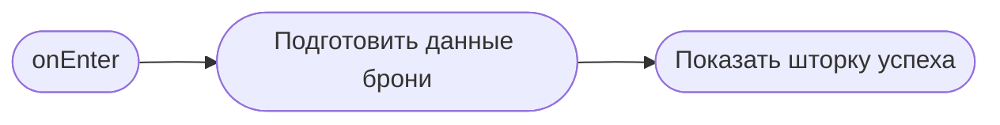

# Бронирование оформлено

**ID:** BS-003  
**Тип:** Bottom Sheet  
**Домен:** 02. Запись на слот  
**Приоритет:** High  
**Статус:** Черновик  
**Функциональные блоки:** FB-BOOKING-001  
**Зона авторизации:** АЗ  
**Дизайн-макет:** [BS-003-booking-success.md](../3-design-brief/BS-003-booking-success.md)

---

## Содержание

- [История изменений](#история-изменений)
- [Обзор](#обзор)
- [Навигация](#навигация)
- [Входные данные](#входные-данные)
- [Применяемые логики](#применяемые-логики)
- [Свойства Bottom Sheet](#свойства-bottom-sheet)
- [Инициализация](#инициализация)
- [Используемые запросы](#используемые-запросы)
- [Макет экрана](#макет-экрана)
- [Элементы экрана](#элементы-экрана)
- [Состояния экрана](#состояния-экрана)
- [Действия пользователя](#действия-пользователя)
- [Связанные требования](#связанные-требования)
- [Критерии приёмки](#критерии-приёмки)

---

## История изменений

| Релиз | ТЗ | Описание изменений |
|-------|-----|-------------------|
| 0.1.0 | BS-003 | Первичная спецификация шторки успешного бронирования |

---

## Обзор

Экран подтверждает клиенту, что запись создана, и помогает перейти к следующим действиям: посмотреть бронь или закрыть экран и вернуться в расписание.

### User Story

> Как клиент, я хочу увидеть подтверждение брони, чтобы быть уверенным, что запись прошла успешно.

### Бизнес-ценность

- Уменьшает тревогу после оплаты и подтверждения.
- Направляет пользователя к следующим шагам.
- Поддерживает напоминания о предстоящем заезде.

---

## Навигация

### Входящая

| Источник | Триггер | Условие | Передаваемые параметры |
|----------|---------|---------|------------------------|
| [BS-002-booking-confirm.md](BS-002-booking-confirm.md) | Успешное создание брони | Запрос завершился успешно | `booking` |

### Исходящая

| Назначение | Триггер | Передаваемые параметры |
|------------|---------|------------------------|
| [SCR-005-my-bookings.md](SCR-005-my-bookings.md) | Тап «Мои записи» | — |
| [SCR-002-schedule.md](SCR-002-schedule.md) | Закрытие / «На главную» | — |

---

## Входные данные

| Название | Тип | Возможные значения | Описание |
|----------|-----|-------------------|----------|
| `booking` | Состояние | объект | Данные созданной брони: дата, время, маршрут, статус. |
| `reminderEnabled` | Состояние | true/false | Наличие согласия на push-напоминания. |

---

## Применяемые логики

| Логика | Элемент/Триггер | Описание |
|--------|-----------------|----------|
| Паттерн состояний экрана | Открытие / успех / предложение push | Content / Optional action. |
| Логика напоминаний | CTA push | Предложение включить уведомления при первом входе. |

---

## Свойства Bottom Sheet

| Свойство | Значение |
|----------|----------|
| Высота | Динамическая |
| Закрытие свайпом | Да |
| Закрытие по тапу вне области | Да |
| Затемнение фона | Да |
| Кнопка закрытия | Да |

---

## Инициализация

### Диаграмма загрузки



### Запросы при открытии

| № | Запрос | Критичный | Зависит от | Условие |
|---|--------|-----------|------------|---------|
| — | Сетевые запросы при открытии не выполняются | — | — | Данные уже есть в контексте |

---

## Используемые запросы

> В MVP на этом экране дополнительные запросы обычно не требуются.

---

## Макет экрана

### Структура

```text
┌──────────────────────────────┐
│ ✓ Бронирование оформлено     │
├──────────────────────────────┤
│ 21 июня · 18:00              │
│ Маршрут · инструктор         │
│ [Мои записи]                 │
│ [На главную]                 │
└──────────────────────────────┘
```

### Компоненты

| Компонент | Описание | Обязательность |
|-----------|----------|----------------|
| Иконка успеха | Подтверждение результата | Да |
| Краткая сводка брони | Дата, время и маршрут | Да |
| Кнопка «Мои записи» | Переход к деталям | Да |
| Кнопка «На главную» | Возврат в расписание | Да |

---

## Элементы экрана

| Элемент | Описание | Источник данных | Валидация | Действие |
|---------|----------|-----------------|-----------|----------|
| Заголовок успеха | «Бронирование оформлено» | — | — | — |
| Сводка заезда | Краткая информация | `booking` | — | — |
| Кнопка «Мои записи» | Перейти к списку | — | — | Переход |
| Кнопка «На главную» | Закрыть и вернуться | — | — | Закрытие |

---

## Состояния экрана

| Состояние | Условие | Отображение |
|-----------|---------|-------------|
| Content | Бронирование создано | Успешный экран |
| Optional action | Пользователь не разрешил пуши | Предложение включить уведомления |

---

## Действия пользователя

| Действие | Элемент | Триггер | Результат |
|----------|---------|---------|-----------|
| Открыть мои записи | Кнопка | Tap | Переход к [SCR-005-my-bookings.md](SCR-005-my-bookings.md) |
| Закрыть экран | Кнопка / свайп | Tap / gesture | Возврат в расписание |

---

## Связанные требования

| ID | Название | Приоритет |
|----|----------|-----------|
| FT-029 | Напоминания после создания брони | Medium |
| FT-030 | Понятное подтверждение успеха | High |

---

## Критерии приёмки

| ID | Критерий |
|----|----------|
| AC-001 | Дано успешное создание брони, Когда пользователь видит шторку, Тогда он понимает, что запись оформлена и может перейти к своим записям. |
| AC-002 | Дано пользователь закрывает экран, Когда он возвращается в расписание, Тогда он не теряет контекст и видит актуальный список. |
