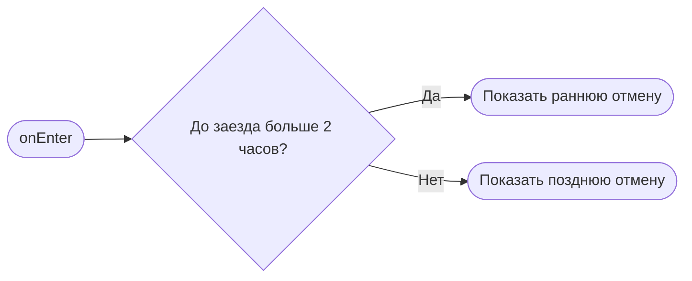

# Подтверждение отмены

**ID:** BS-004  
**Тип:** Bottom Sheet  
**Домен:** 03. Мои записи  
**Приоритет:** High  
**Статус:** Черновик  
**Функциональные блоки:** FB-BOOKING-003  
**Зона авторизации:** АЗ  
**Дизайн-макет:** [BS-004-cancel-confirm.md](../3-design-brief/BS-004-cancel-confirm.md)

---

## Содержание

- [История изменений](#история-изменений)
- [Обзор](#обзор)
- [Навигация](#навигация)
- [Входные данные](#входные-данные)
- [Применяемые логики](#применяемые-логики)
- [Свойства Bottom Sheet](#свойства-bottom-sheet)
- [Инициализация](#инициализация)
- [Используемые запросы](#используемые-запросы)
- [Макет экрана](#макет-экрана)
- [Элементы экрана](#элементы-экрана)
- [Состояния экрана](#состояния-экрана)
- [Действия пользователя](#действия-пользователя)
- [Связанные требования](#связанные-требования)
- [Критерии приёмки](#критерии-приёмки)

---

## История изменений

| Релиз | ТЗ | Описание изменений |
|-------|-----|-------------------|
| 0.1.0 | BS-004 | Первичная спецификация шторки подтверждения отмены |

---

## Обзор

Шторка помогает клиенту осознанно отменить бронь и понимает последствия отмены в зависимости от времени до заезда.

### User Story

> Как клиент, я хочу увидеть последствия отмены, чтобы принять решение без лишней тревоги.

### Бизнес-ценность

- Повышает прозрачность правил отмены.
- Уменьшает споры и поддержку.
- Сберегает доверие клиента к сервису.

---

## Навигация

### Входящая

| Источник | Триггер | Условие | Передаваемые параметры |
|----------|---------|---------|------------------------|
| [SCR-006-booking-details.md](SCR-006-booking-details.md) | Тап «Отменить запись» | Бронь активна | `bookingId`, `startAt` |

### Исходящая

| Назначение | Триггер | Передаваемые параметры |
|------------|---------|------------------------|
| [SCR-006-booking-details.md](SCR-006-booking-details.md) | Отмена действия / успех отмены | `bookingStatus` |
| [SCR-005-my-bookings.md](SCR-005-my-bookings.md) | Успешная отмена | — |

---

## Входные данные

| Название | Тип | Возможные значения | Описание |
|----------|-----|-------------------|----------|
| `bookingId` | Состояние | UUID | Идентификатор брони. |
| `startAt` | Состояние | дата/время | Время старта заезда. |
| `cancelWindow` | Производное | early/late | Определяется по правилу 2 часов. |

---

## Применяемые логики

| Логика | Элемент/Триггер | Описание |
|--------|-----------------|----------|
| Правило отмены 2 часов | Открытие шторки | Определяется, ранняя или поздняя отмена. |
| Паттерн состояний экрана | Подтверждение / ошибка / загрузка | Loading / Content / Error. |

---

## Свойства Bottom Sheet

| Свойство | Значение |
|----------|----------|
| Высота | Динамическая |
| Закрытие свайпом | Да |
| Закрытие по тапу вне области | Да |
| Затемнение фона | Да |
| Кнопка закрытия | Да |

---

## Инициализация

### Диаграмма загрузки



### Запросы при открытии

| № | Запрос | Критичный | Зависит от | Условие |
|---|--------|-----------|------------|---------|
| — | Сетевые запросы при открытии не выполняются | — | — | Данные уже доступны в контексте |

---

## Используемые запросы

### cancelBooking

**Тип:** REST  
**Метод:** POST  
**Спецификация:** [../api/bookings/api.yaml](../api/bookings/api.yaml) → `cancelBooking`

**Триггер:** Тап на кнопку «Отменить запись».

**Параметры:**

| Параметр | Тип | Обязательность | Источник | Описание |
|----------|-----|----------------|----------|----------|
| `bookingId` | string | Да | `bookingId` | Идентификатор записи. |

**Обработка ответа:**

| Результат | Условие | UI-реакция |
|-----------|---------|------------|
| Успех | 200/204 | Закрыть шторку и обновить список записей |
| Ошибка | 4xx/5xx | Показать сообщение и оставить пользователя на экране |
| Сеть | Нет соединения | Error state с подсказкой |

---

## Макет экрана

### Структура

```text
┌──────────────────────────────┐
│ Отменить запись?            │
├──────────────────────────────┤
│ До заезда меньше 2 часов     │
│ Место может не освободиться  │
│ [Отменить запись]           │
│ [Оставить запись]           │
└──────────────────────────────┘
```

### Компоненты

| Компонент | Описание | Обязательность |
|-----------|----------|----------------|
| Предупреждение | Описание последствий отмены | Да |
| Кнопка «Отменить запись» | Подтверждение действия | Да |
| Кнопка «Оставить запись» | Отмена действия | Да |

---

## Элементы экрана

| Элемент | Описание | Источник данных | Валидация | Действие |
|---------|----------|-----------------|-----------|----------|
| Заголовок | «Отменить запись?» | — | — | — |
| Пояснение | Раннее / позднее правило | `cancelWindow` | — | — |
| Кнопка подтверждения | Отмена брони | — | — | `cancelBooking` |
| Кнопка отмены | Сохранить бронь | — | — | Закрыть шторку |

---

## Состояния экрана

| Состояние | Условие | Отображение |
|-----------|---------|-------------|
| Loading | Выполняется запрос отмены | Индикатор загрузки |
| Content | Данные готовы | Пояснение и CTA |
| Error | Ошибка запроса | Ошибка под кнопкой |

---

## Действия пользователя

| Действие | Элемент | Триггер | Результат |
|----------|---------|---------|-----------|
| Подтвердить отмену | Кнопка | Tap | Запрос отмены и обновление статуса |
| Сохранить бронь | Кнопка | Tap | Закрытие шторки без изменений |
| Закрыть | Свайп / тап вне области | Gesture | Закрытие шторки |

---

## Связанные требования

| ID | Название | Приоритет |
|----|----------|-----------|
| FT-018 | Ранняя отмена без проблем | High |
| FT-019 | Поздняя отмена с предупреждением | High |
| FT-020 | Честное объяснение последствий | High |

---

## Критерии приёмки

| ID | Критерий |
|----|----------|
| AC-001 | Дано пользователь нажал «Отменить запись», Когда он подтверждает действие, Тогда бронь меняет статус и отображается в списке как отменённая. |
| AC-002 | Дано до заезда осталось меньше 2 часов, Когда пользователь открывает шторку, Тогда он видит предупреждение о возможных последствиях. |
