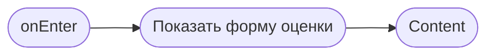

# Оценка маршала

**ID:** BS-005  
**Тип:** Bottom Sheet  
**Домен:** 03. Мои записи  
**Приоритет:** Medium  
**Статус:** Черновик  
**Функциональные блоки:** FB-BOOKING-004  
**Зона авторизации:** АЗ  
**Дизайн-макет:** [BS-005-marshal-rating.md](../3-design-brief/BS-005-marshal-rating.md)

---

## Содержание

- [История изменений](#история-изменений)
- [Обзор](#обзор)
- [Навигация](#навигация)
- [Входные данные](#входные-данные)
- [Применяемые логики](#применяемые-логики)
- [Свойства Bottom Sheet](#свойства-bottom-sheet)
- [Инициализация](#инициализация)
- [Используемые запросы](#используемые-запросы)
- [Макет экрана](#макет-экрана)
- [Элементы экрана](#элементы-экрана)
- [Состояния экрана](#состояния-экрана)
- [Действия пользователя](#действия-пользователя)
- [Связанные требования](#связанные-требования)
- [Критерии приёмки](#критерии-приёмки)

---

## История изменений

| Релиз | ТЗ | Описание изменений |
|-------|-----|-------------------|
| 0.1.0 | BS-005 | Первичная спецификация шторки оценки маршала |

---

## Обзор

Шторка позволяет клиенту быстро оценить маршала после заезда. Оценка необязательна и не должна быть сложной или формальной.

### User Story

> Как клиент, я хочу быстро оценить маршала, чтобы поделиться впечатлением после заезда.

### Бизнес-ценность

- Повышает качество сервиса.
- Даёт обратную связь для центра.
- Не перегружает клиента лишними полями.

---

## Навигация

### Входящая

| Источник | Триггер | Условие | Передаваемые параметры |
|----------|---------|---------|------------------------|
| [SCR-006-booking-details.md](SCR-006-booking-details.md) | Тап «Оценить маршала» | Бронь завершена | `bookingId`, `marshalName` |

### Исходящая

| Назначение | Триггер | Передаваемые параметры |
|------------|---------|------------------------|
| [SCR-006-booking-details.md](SCR-006-booking-details.md) | Отправка оценки / пропуск | `ratingStatus` |

---

## Входные данные

| Название | Тип | Возможные значения | Описание |
|----------|-----|-------------------|----------|
| `bookingId` | Состояние | UUID | Идентификатор завершённой брони. |
| `marshalName` | Состояние | string | Имя маршала для отображения. |
| `rating` | Состояние | 1–5 | Оценка клиента. |
| `comment` | Состояние | string | Необязательный комментарий. |

---

## Применяемые логики

| Логика | Элемент/Триггер | Описание |
|--------|-----------------|----------|
| Валидация оценки | Кнопка «Отправить» | Оценка должна быть выбрана, комментарий необязателен. |
| Паттерн состояний экрана | Загрузка / контент / успех | Loading / Content / Success. |

---

## Свойства Bottom Sheet

| Свойство | Значение |
|----------|----------|
| Высота | Динамическая |
| Закрытие свайпом | Да |
| Закрытие по тапу вне области | Да |
| Затемнение фона | Да |
| Кнопка закрытия | Да |

---

## Инициализация

### Диаграмма загрузки



### Запросы при открытии

| № | Запрос | Критичный | Зависит от | Условие |
|---|--------|-----------|------------|---------|
| — | Сетевые запросы при открытии не выполняются | — | — | Данные уже доступны в контексте |

---

## Используемые запросы

> В MVP отправка оценки может быть реализована как локальный event или через общий endpoint отзывов, если он появится в API.

---

## Макет экрана

### Структура

```text
┌──────────────────────────────┐
│ Как прошёл заезд?            │
├──────────────────────────────┤
│ Маршал Алексей               │
│ ★★★☆☆                       │
│ [Комментарий ...]            │
│ [Отправить] [Пропустить]     │
└──────────────────────────────┘
```

### Компоненты

| Компонент | Описание | Обязательность |
|-----------|----------|----------------|
| Шкала оценки | 1–5 звёзд | Да |
| Поле комментария | Необязательное описание | Нет |
| Кнопка «Отправить» | Сохранить оценку | Да |
| Кнопка «Пропустить» | Закрыть без сохранения | Да |

---

## Элементы экрана

| Элемент | Описание | Источник данных | Валидация | Действие |
|---------|----------|-----------------|-----------|----------|
| Заголовок | «Как прошёл заезд?» | — | — | — |
| Имя маршала | Отображение контекста | `marshalName` | — | — |
| Шкала оценки | Выбор 1–5 | `rating` | Обязательное поле | — |
| Комментарий | Доп. отзыв | `comment` | Необязательное | — |
| Кнопка «Отправить» | Сохранить оценку | — | `rating` обязателен | Отправка |

---

## Состояния экрана

| Состояние | Условие | Отображение |
|-----------|---------|-------------|
| Content | Форма доступна | Поля оценки и комментария |
| Loading | Отправка оценки | Индикатор загрузки |
| Success | Оценка сохранена | Подтверждение отправки |

---

## Действия пользователя

| Действие | Элемент | Триггер | Результат |
|----------|---------|---------|-----------|
| Выбрать оценку | Звёзды | Tap | Обновление состояния |
| Отправить оценку | Кнопка | Tap | Сохранение оценки |
| Пропустить | Кнопка | Tap | Закрытие шторки без сохранения |

---

## Связанные требования

| ID | Название | Приоритет |
|----|----------|-----------|
| FT-026 | Оценка маршала от 1 до 5 | Medium |
| FT-027 | Необязательный комментарий | Medium |
| FT-028 | Оценка не для публичного рейтинга | Medium |

---

## Критерии приёмки

| ID | Критерий |
|----|----------|
| AC-001 | Дано пользователь выбрал оценку, Когда он нажимает «Отправить», Тогда оценка сохраняется и экран закрывается. |
| AC-002 | Дано пользователь нажимает «Пропустить», Когда он не хочет оставлять отзыв, Тогда шторка закрывается без сохранения данных. |
