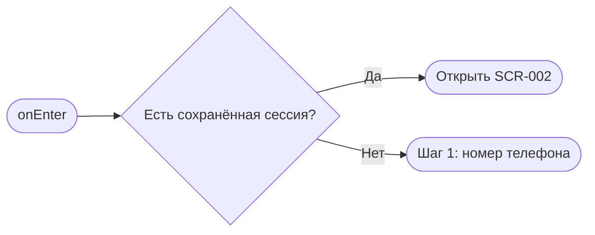

# Вход / регистрация

**ID:** SCR-001  
**Тип:** Экран  
**Домен:** 01. Авторизация  
**Приоритет:** High  
**Статус:** Черновик  
**Функциональные блоки:** FB-AUTH-001, FB-AUTH-002  
**Зона авторизации:** НЗ  
**Дизайн-макет:** [SCR-001-auth.md](../3-design-brief/SCR-001-auth.md)

---

## Содержание

- [История изменений](#история-изменений)
- [Обзор](#обзор)
- [Навигация](#навигация)
- [Входные данные](#входные-данные)
- [Применяемые логики](#применяемые-логики)
- [Инициализация](#инициализация)
- [Используемые запросы](#используемые-запросы)
- [Макет экрана](#макет-экрана)
- [Элементы экрана](#элементы-экрана)
- [Состояния экрана](#состояния-экрана)
- [Действия пользователя](#действия-пользователя)
- [Связанные требования](#связанные-требования)
- [Критерии приёмки](#критерии-приёмки)

---

## История изменений

| Релиз | ТЗ | Описание изменений |
|-------|-----|-------------------|
| 0.1.0 | SCR-001 | Первичная спецификация экрана входа и регистрации по брифу «Апекс» |

---

## Обзор

Экран позволяет клиенту пройти авторизацию по номеру телефона и коду из SMS, а при первом входе — указать имя. Это входная точка для сценариев записи и просмотра личных броней.

### User Story

> Как клиент картинг-центра, я хочу быстро войти в приложение, чтобы сразу перейти к записи на заезд.

### Бизнес-ценность

- Уменьшает барьер входа.
- Поддерживает сценарий записи без лишних полей.
- Позволяет сохранить персонализированный опыт после первого входа.

---

## Навигация

### Входящая

| Источник | Триггер | Условие | Передаваемые параметры |
|----------|---------|---------|------------------------|
| [SCR-003-ride-details.md](SCR-003-ride-details.md) | Тап «Записаться» без авторизации | Пользователь не авторизован | `slotId` |
| Запуск приложения | Открытие приложения | Сессии нет | — |

### Исходящая

| Назначение | Триггер | Передаваемые параметры |
|------------|---------|------------------------|
| [SCR-002-schedule.md](SCR-002-schedule.md) | Успешная авторизация | — |
| [SCR-004-booking.md](SCR-004-booking.md) | Возврат в сценарий записи после входа | `slotId` |

---

## Входные данные

| Название | Тип | Возможные значения | Описание |
|----------|-----|-------------------|----------|
| `phone` | Состояние | E.164 | Номер телефона клиента для запроса кода. |
| `code` | Состояние | 4–6 цифр | OTP-код из SMS. |
| `name` | Состояние | 1–100 символов | Имя клиента, заполняется только при первом входе. |
| `session` | Защищённое хранилище | токены / отсутствует | Используется для определения, авторизован ли пользователь. |

---

## Применяемые логики

| Логика | Элемент/Триггер | Описание |
|--------|-----------------|----------|
| OTP-авторизация | Шаг 1/2/3 | Запрос кода, проверка кода, хранение токенов, переход к следующему шагу. |
| Паттерн состояний экрана | Любое действие | Loading / Content / Error для шагов ввода. |

---

## Инициализация

### Диаграмма загрузки



### Запросы при открытии

| № | Запрос | Критичный | Зависит от | Условие |
|---|--------|-----------|------------|---------|
| — | Сетевые запросы при открытии не выполняются | — | — | Только проверка локальной сессии |

---

## Используемые запросы

### requestAuthCode

**Тип:** REST  
**Метод:** POST  
**Спецификация:** [../api/auth/api.yaml](../api/auth/api.yaml) → `requestAuthCode`

**Триггер:** Тап на кнопку «Получить код».

**Параметры:**

| Параметр | Тип | Обязательность | Источник | Описание |
|----------|-----|----------------|----------|----------|
| `phone` | string | Да | Поле телефона | Номер в формате E.164 |

**Обработка ответа:**

| Результат | Условие | UI-реакция |
|-----------|---------|------------|
| Успех | 200 | Перейти на шаг 2 и запустить таймер повторной отправки |
| Ошибка | 400/429/5xx | Показать сообщение и сохранить состояние ввода |
| Сеть | Нет соединения | Error state с подсказкой |

### verifyAuthCode

**Тип:** REST  
**Метод:** POST  
**Спецификация:** [../api/auth/api.yaml](../api/auth/api.yaml) → `verifyAuthCode`

**Триггер:** Тап на кнопку «Подтвердить». 

**Параметры:**

| Параметр | Тип | Обязательность | Источник | Описание |
|----------|-----|----------------|----------|----------|
| `phone` | string | Да | Состояние `phone` | Номер телефона |
| `code` | string | Да | Состояние `code` | OTP-код |

**Обработка ответа:**

| Результат | Условие | UI-реакция |
|-----------|---------|------------|
| Успех | `is_new = true` | Показать шаг ввода имени |
| Успех | `is_new = false` | Сохранить токены и перейти на следующий экран |
| Ошибка | Неверный код | Показать ошибку и дать повторить |

### updateProfile

**Тип:** REST  
**Метод:** PATCH  
**Спецификация:** [../api/profile/api.yaml](../api/profile/api.yaml) → `updateProfile`

**Триггер:** Тап на кнопку «Продолжить» после ввода имени.

---

## Макет экрана

### Структура

```text
┌──────────────────────────────┐
│ Апекс                      │
├──────────────────────────────┤
│ Введите номер телефона       │
│ [   +7 ___ ___ __ __ ]      │
│ [Получить код]               │
└──────────────────────────────┘
```

### Компоненты

| Компонент | Описание | Обязательность |
|-----------|----------|----------------|
| Поле телефона | Ввод номера, маска | Да |
| Кнопка «Получить код» | Запрос OTP | Да |
| Поле кода | Ввод кода из SMS | Да |
| Поле имени | Только для нового клиента | Условно |

---

## Элементы экрана

### 1. Шаг 1 — телефон

| Элемент | Описание | Источник данных | Валидация | Действие |
|---------|----------|-----------------|-----------|----------|
| Поле телефона | Ввод номера | `phone` | Формат E.164 | — |
| Кнопка «Получить код» | Отправка SMS | — | Обязательное поле | Запрос `requestAuthCode` |

### 2. Шаг 2 — код

| Элемент | Описание | Источник данных | Валидация | Действие |
|---------|----------|-----------------|-----------|----------|
| Поле кода | OTP из SMS | `code` | 4–6 цифр | — |
| Ссылка «Отправить ещё раз» | Повторная отправка | — | — | Повторный `requestAuthCode` |

### 3. Шаг 3 — имя

| Элемент | Описание | Источник данных | Валидация | Действие |
|---------|----------|-----------------|-----------|----------|
| Поле имени | Имя клиента | `name` | 1–100 символов | — |
| Кнопка «Продолжить» | Завершение входа | — | — | `updateProfile` |

---

## Состояния экрана

| Состояние | Условие | Отображение |
|-----------|---------|-------------|
| Loading | Запрос кода / проверка | Индикатор загрузки |
| Content | Ввод данных | Форма шага |
| Error | Ошибка сети или кода | Ошибка под полем / снизу |

---

## Действия пользователя

| Действие | Элемент | Триггер | Результат |
|----------|---------|---------|-----------|
| Запросить SMS | Кнопка | Tap | Переход на шаг 2 |
| Подтвердить код | Кнопка | Tap | Переход к шагу 3 или в приложение |
| Завершить вход | Кнопка | Tap | Переход в расписание |

---

## Связанные требования

| ID | Название | Приоритет |
|----|----------|-----------|
| FT-006 | Вход по номеру телефона с SMS | High |
| FT-007 | Имя и телефон в профиле | High |
| FT-008 | Авторизация перед записью | High |

---

## Критерии приёмки

| ID | Критерий |
|----|----------|
| AC-001 | Дано нет сессии, Когда пользователь вводит номер и получает код, Тогда экран переходит на шаг подтверждения. |
| AC-002 | Дано неверный код, Когда пользователь отправляет форму, Тогда показывается ошибка и код можно исправить. |
| AC-003 | Дано первый вход, Когда пользователь заполняет имя и подтверждает, Тогда он попадает в приложение и его профиль сохраняется. |
