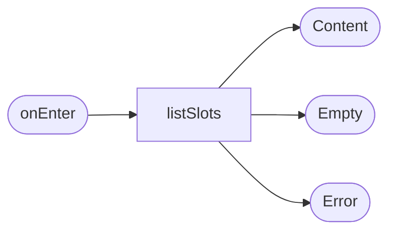

# Расписание заездов

**ID:** SCR-002  
**Тип:** Экран  
**Домен:** 01. Расписание  
**Приоритет:** Critical  
**Статус:** Черновик  
**Функциональные блоки:** FB-SCHEDULE-001, FB-SCHEDULE-002  
**Зона авторизации:** НЗ + АЗ  
**Дизайн-макет:** [SCR-002-schedule.md](../3-design-brief/SCR-002-schedule.md)

---

## Содержание

- [История изменений](#история-изменений)
- [Обзор](#обзор)
- [Навигация](#навигация)
- [Входные данные](#входные-данные)
- [Применяемые логики](#применяемые-логики)
- [Инициализация](#инициализация)
- [Используемые запросы](#используемые-запросы)
- [Макет экрана](#макет-экрана)
- [Элементы экрана](#элементы-экрана)
- [Состояния экрана](#состояния-экрана)
- [Действия пользователя](#действия-пользователя)
- [Связанные требования](#связанные-требования)
- [Критерии приёмки](#критерии-приёмки)

---

## История изменений

| Релиз | ТЗ | Описание изменений |
|-------|-----|-------------------|
| 0.1.0 | SCR-002 | Первичная спецификация экрана расписания по брифу «Апекс» |

---

## Обзор

Экран показывает ближайшие заезды и служит точкой входа в запись. Пользователь может быстро отобрать подходящий слот по дате и перейти к деталям.

### User Story

> Как клиент, я хочу видеть доступные заезды, чтобы выбрать подходящий и записаться.

### Бизнес-ценность

- Снижает нагрузку на ручную запись.
- Делает расписание прозрачным и понятным.
- Ускоряет путь к бронированию.

---

## Навигация

### Входящая

| Источник | Триггер | Условие | Передаваемые параметры |
|----------|---------|---------|------------------------|
| Запуск приложения | Открытие приложения | Пользователь авторизован или открыт как гостевой режим | — |
| [SCR-001-auth.md](SCR-001-auth.md) | Успешная авторизация | После входа | — |

### Исходящая

| Назначение | Триггер | Передаваемые параметры |
|------------|---------|------------------------|
| [SCR-003-ride-details.md](SCR-003-ride-details.md) | Тап по карточке слота | `slotId` |
| [BS-001-date-filter.md](BS-001-date-filter.md) | Тап на фильтр | — |

---

## Входные данные

| Название | Тип | Возможные значения | Описание |
|----------|-----|-------------------|----------|
| `dateRange` | Состояние | диапазон дат | Выбранный диапазон для фильтрации расписания. |
| `onlyAvailable` | Состояние | true/false | Показывать только слоты с свободными местами. |

---

## Применяемые логики

| Логика | Элемент/Триггер | Описание |
|--------|-----------------|----------|
| Фильтрация расписания | Кнопка фильтра / загрузка | Формирование списка слотов по дате и доступности. |
| Паттерн состояний экрана | Открытие / обновление | Loading / Content / Empty / Error. |

---

## Инициализация

### Диаграмма загрузки



### Запросы при открытии

| № | Запрос | Критичный | Зависит от | Условие |
|---|--------|-----------|------------|---------|
| 1 | [listSlots](../api/slots/api.yaml) | Да | — | Всегда |

---

## Используемые запросы

### listSlots

**Тип:** REST  
**Метод:** GET  
**Спецификация:** [../api/slots/api.yaml](../api/slots/api.yaml) → `listSlots`

**Триггер:** Открытие экрана / pull-to-refresh.

**Параметры:**

| Параметр | Тип | Обязательность | Источник | Описание |
|----------|-----|----------------|----------|----------|
| `date_from` | string | Нет | `dateRange` | Начало периода |
| `date_to` | string | Нет | `dateRange` | Конец периода |
| `only_available` | bool | Нет | `onlyAvailable` | Только доступные слоты |

**Обработка ответа:**

| Результат | Условие | UI-реакция |
|-----------|---------|------------|
| Успех | Есть данные | Показать список карточек |
| Успех | Пустой список | Empty state |
| Ошибка | 4xx/5xx/сеть | Error state |

---

## Макет экрана

### Структура

```text
┌──────────────────────────────┐
│ Расписание         [фильтр] │
├──────────────────────────────┤
│ Сегодня · 18:30 · трасса     │
│ Свободно 3 из 8 · 2300 ₽     │
│ ...                          │
└──────────────────────────────┘
```

### Компоненты

| Компонент | Описание | Обязательность |
|-----------|----------|----------------|
| Заголовок | «Расписание» | Да |
| Карточка слота | Дата, время, трасса, цена, места | Да |
| Фильтр дат | Открывает bottom sheet | Да |

---

## Элементы экрана

| Элемент | Описание | Источник данных | Валидация | Действие |
|---------|----------|-----------------|-----------|----------|
| Список слотов | Список карточек | `listSlots` | — | Открыть [SCR-003-ride-details.md](SCR-003-ride-details.md) |
| Кнопка фильтра | Открывает диапазон дат | — | — | Открыть [BS-001-date-filter.md](BS-001-date-filter.md) |

---

## Состояния экрана

| Состояние | Условие | Отображение |
|-----------|---------|-------------|
| Loading | Загрузка расписания | Скелетоны |
| Content | Данные получены | Список карточек |
| Empty | Нет доступных слотов | Заглушка |
| Error | Ошибка сети/HTTP | State с кнопкой «Обновить» |

---

## Действия пользователя

| Действие | Элемент | Триггер | Результат |
|----------|---------|---------|-----------|
| Открыть слот | Карточка | Tap | Переход на [SCR-003-ride-details.md](SCR-003-ride-details.md) |
| Открыть фильтр | Кнопка | Tap | Открыть [BS-001-date-filter.md](BS-001-date-filter.md) |
| Обновить | Pull-to-refresh | Gesture | Повторный `listSlots` |

---

## Связанные требования

| ID | Название | Приоритет |
|----|----------|-----------|
| FT-001 | Показывать ближайшие 7 дней | High |
| FT-003 | Empty state при отсутствии заездов | High |
| FT-004 | Показ данных о заезде | High |
| FT-005 | Учитывать тип заезда | Medium |

---

## Критерии приёмки

| ID | Критерий |
|----|----------|
| AC-001 | Дано расписание доступно, Когда пользователь открывает экран, Тогда он видит список ближайших заездов. |
| AC-002 | Дано отсутствуют заезды, Когда экран загружается, Тогда отображается понятная заглушка. |
| AC-003 | Дано пользователь выбрал слот, Когда тапает по карточке, Тогда открывается детальная карточка заезда. |
