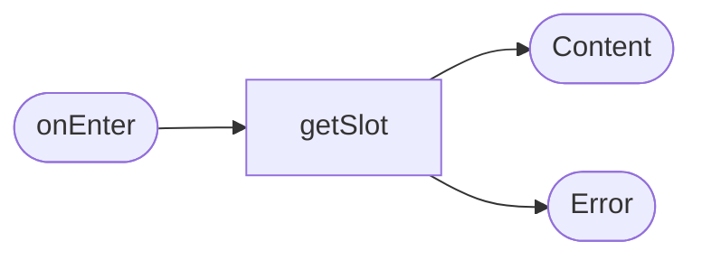

# Карточка заезда

**ID:** SCR-003  
**Тип:** Экран  
**Домен:** 01. Просмотр заезда  
**Приоритет:** Critical  
**Статус:** Черновик  
**Функциональные блоки:** FB-RIDE-001, FB-RIDE-002  
**Зона авторизации:** НЗ + АЗ  
**Дизайн-макет:** [SCR-003-ride-details.md](../3-design-brief/SCR-003-ride-details.md)

---

## Содержание

- [История изменений](#история-изменений)
- [Обзор](#обзор)
- [Навигация](#навигация)
- [Входные данные](#входные-данные)
- [Применяемые логики](#применяемые-логики)
- [Инициализация](#инициализация)
- [Используемые запросы](#используемые-запросы)
- [Макет экрана](#макет-экрана)
- [Элементы экрана](#элементы-экрана)
- [Состояния экрана](#состояния-экрана)
- [Действия пользователя](#действия-пользователя)
- [Связанные требования](#связанные-требования)
- [Критерии приёмки](#критерии-приёмки)

---

## История изменений

| Релиз | ТЗ | Описание изменений |
|-------|-----|-------------------|
| 0.1.0 | SCR-003 | Первичная спецификация карточки заезда |

---

## Обзор

Экран показывает полную информацию по выбранному заезду: дату, время, трассу, инструктора, цену, доступность и статус. Отсюда пользователь может перейти к записи или увидеть причину недоступности.

### User Story

> Как клиент, я хочу посмотреть детали заезда, чтобы принять решение о записи.

### Бизнес-ценность

- Снижает сомнения перед записью.
- Увеличивает доверие к сервису.
- Позволяет быстро понять, доступна ли запись.

---

## Навигация

### Входящая

| Источник | Триггер | Условие | Передаваемые параметры |
|----------|---------|---------|------------------------|
| [SCR-002-schedule.md](SCR-002-schedule.md) | Тап по карточке | Всегда | `slotId` |

### Исходящая

| Назначение | Триггер | Передаваемые параметры |
|------------|---------|------------------------|
| [SCR-004-booking.md](SCR-004-booking.md) | Тап «Записаться» | `slotId` |
| [SCR-001-auth.md](SCR-001-auth.md) | Тап «Записаться» без сессии | `slotId` |

---

## Входные данные

| Название | Тип | Возможные значения | Описание |
|----------|-----|-------------------|----------|
| `slotId` | Состояние | UUID | Идентификатор выбранного заезда. |

---

## Применяемые логики

| Логика | Элемент/Триггер | Описание |
|--------|-----------------|----------|
| Доступность записи | Кнопка «Записаться» | Блокируется при отсутствии мест или отмене слота. |
| Паттерн состояний экрана | Загрузка / ошибка | Loading / Error state. |

---

## Инициализация

### Диаграмма загрузки



### Запросы при открытии

| № | Запрос | Критичный | Зависит от | Условие |
|---|--------|-----------|------------|---------|
| 1 | [getSlot](../api/slots/api.yaml) | Да | — | Всегда |

---

## Используемые запросы

### getSlot

**Тип:** REST  
**Метод:** GET  
**Спецификация:** [../api/slots/api.yaml](../api/slots/api.yaml) → `getSlot`

**Триггер:** Открытие экрана.

**Параметры:**

| Параметр | Тип | Обязательность | Источник | Описание |
|----------|-----|----------------|----------|----------|
| `slotId` | string | Да | `slotId` | Идентификатор заезда |

**Обработка ответа:**

| Результат | Условие | UI-реакция |
|-----------|---------|------------|
| Успех | `status = scheduled` | Показать карточку и активную CTA |
| Успех | `free_seats = 0` | Показать состояние «Мест нет» |
| Ошибка | 404/401/5xx/сеть | Error state |

---

## Макет экрана

### Структура

```text
┌──────────────────────────────┐
│ ← Карточка заезда           │
├──────────────────────────────┤
│ Дата, время                  │
│ Трасса · тип заезда          │
│ Маршал · цена               │
│ Свободно X из Y             │
│ [Записаться]                │
└──────────────────────────────┘
```

### Компоненты

| Компонент | Описание | Обязательность |
|-----------|----------|----------------|
| Заголовок | Дата и время | Да |
| Блок маршрута | Название трассы, тип | Да |
| Блок инструктора | Имя маршала | Да |
| CTA | «Записаться» | Да |

---

## Элементы экрана

| Элемент | Описание | Источник данных | Валидация | Действие |
|---------|----------|-----------------|-----------|----------|
| Блок даты/времени | Ключевая дата заезда | `getSlot` | — | — |
| Блок маршрута | Трасса и тип | `getSlot` | — | — |
| Блок стоимости | Цена за место | `getSlot` | — | — |
| Кнопка «Записаться» | Переход к бронированию | — | — | Перейти к [SCR-004-booking.md](SCR-004-booking.md) |

---

## Состояния экрана

| Состояние | Условие | Отображение |
|-----------|---------|-------------|
| Loading | Загрузка данных | Скелетон |
| Content | Данные получены | Полная информация |
| NoSeats | Нет мест | CTA неактивна |
| Cancelled | Слот отменён | Статус и без записи |
| Error | Ошибка | Error state |

---

## Действия пользователя

| Действие | Элемент | Триггер | Результат |
|----------|---------|---------|-----------|
| Открыть запись | Кнопка | Tap | Переход к [SCR-004-booking.md](SCR-004-booking.md) |
| Вернуться | Назад | Tap | Возврат к расписанию |

---

## Связанные требования

| ID | Название | Приоритет |
|----|----------|-----------|
| FT-004 | Отображение данных о заезде | High |
| FT-005 | Учитывать тип заезда | Medium |
| FT-008 | Запись только после авторизации | High |

---

## Критерии приёмки

| ID | Критерий |
|----|----------|
| AC-001 | Дано пользователь открыл карточку заезда, Когда данные загружены, Тогда он видит дату, цену, маршрут и доступность. |
| AC-002 | Дано нет свободных мест, Когда пользователь открывает карточку, Тогда CTA «Записаться» неактивна. |
| AC-003 | Дано пользователь нажал «Записаться», Когда сессия отсутствует, Тогда он перенаправляется на экран входа. |
